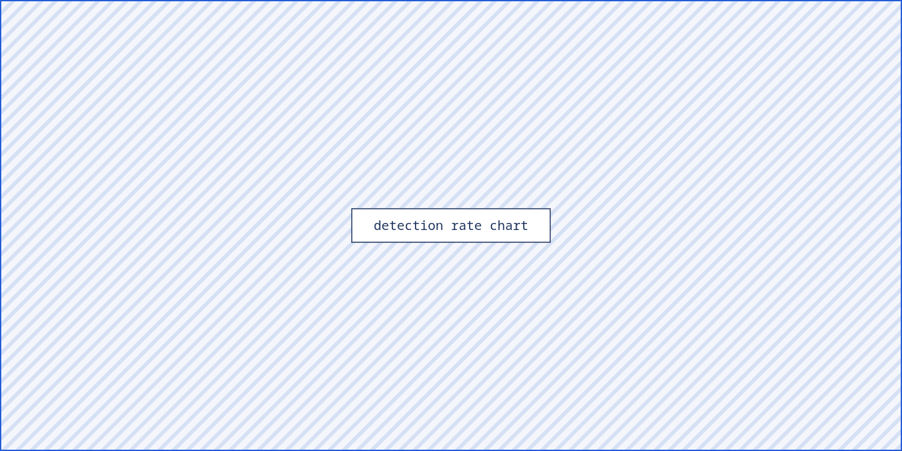

# Introduction

Enterprise intrusions rarely fail at the perimeter. They fail — or succeed — in
the hours that follow, when an attacker who controls one workstation attempts to
reach the systems that hold value. That phase, *lateral movement*, is where
detection has the highest leverage and the poorest coverage.

## Problem statement

Three trends have eroded the effectiveness of network-based detection inside the
perimeter:

1. **Encryption by default.** SMB 3.1.1, WinRM over HTTPS and SSH carry the
   majority of administrative traffic, leaving inspection with metadata only.
2. **Legitimate tooling.** Remote execution frameworks used by attackers are the
   same ones used by system administrators.
3. **Flat east–west visibility.** Sensors are deployed at segment boundaries,
   while lateral movement frequently stays inside a single segment.

Host telemetry answers all three, but conventional agents pay for that visibility
with overhead and with event volumes that operations teams cannot triage.

## Research questions

This work addresses three questions:

- **RQ1** — Can process, authentication and network events be correlated *in the
  kernel* cheaply enough for continuous production use?
- **RQ2** — Does that correlation improve detection of lateral movement compared
  with the same events analysed independently?
- **RQ3** — What is the operational cost, expressed as false positives per host
  per day?

## Contributions

The thesis contributes an open sensor design, a reproducible adversary-emulation
harness, and a measured comparison between correlated and uncorrelated detection
over identical telemetry.

## Structure of the thesis

Chapter 2 reviews the state of the art. Chapter 3 describes the sensor
architecture. Chapter 4 defines the evaluation methodology, and Chapter 5
reports results. Chapter 6 discusses limitations and future work.

# Background and related work

## Lateral movement in the ATT&CK model

MITRE ATT&CK groups lateral movement into nine techniques, of which three
dominate observed incidents: remote services (T1021), use of alternate
authentication material (T1550) and lateral tool transfer (T1570) [@strom2018attack].

## eBPF as a telemetry substrate

eBPF allows verified programs to run in kernel context at defined hook points,
with bounded execution and no module loading [@gregg2019bpf]. For security
telemetry the relevant property is not speed alone but *placement*: a program
attached to `security_socket_connect` observes the connecting task, its
credentials and its ancestry in the same context as the connection itself.

!!! note
    Ring-buffer back-pressure, not instruction cost, is the practical limit of
    eBPF telemetry on busy hosts. Section 3.3 quantifies this.

## Prior host-based approaches

Provenance-graph systems reconstruct causality after the fact from complete
audit streams [@han2020unicorn]. They achieve high fidelity at storage costs
that few organisations sustain. Commercial EDR platforms invert the trade-off,
shipping a filtered event stream and correlating in the cloud, which introduces
latency and vendor-defined visibility.

# Sensor architecture


## Probe placement

The sensor attaches to four hook points, chosen to observe an action once and
only once:

| Hook point                  | Event captured            | Volume (events/host/day) |
|-----------------------------|---------------------------|--------------------------|
| `sched_process_exec`        | process creation          | 9 400                    |
| `security_socket_connect`   | outbound connection       | 27 800                   |
| `security_bprm_creds`       | credential change         | 1 200                    |
| `vfs_write` (filtered)      | tool transfer to disk     | 3 100                    |

Table: Probe placement and observed event volume, averaged over 40 hosts across 14 days.

## Correlation in kernel space

Each connection event is joined, before it leaves the kernel, with the task's
ancestry and the credential state that produced it:

```c
SEC("lsm/socket_connect")
int BPF_PROG(trace_connect, struct socket *sock,
             struct sockaddr *address, int addrlen)
{
    struct task_struct *task = (void *)bpf_get_current_task_btf();
    struct move_evt *e = bpf_ringbuf_reserve(&events, sizeof(*e), 0);
    if (!e)
        return 0;                      /* back-pressure: drop, count, move on */

    e->pid       = task->tgid;
    e->ppid      = task->real_parent->tgid;
    e->cred_hash = cred_fingerprint(task->cred);
    e->dport     = read_dport(address);
    bpf_get_current_comm(&e->comm, sizeof(e->comm));

    bpf_ringbuf_submit(e, 0);
    return 0;
}
```

The 96-byte record is the unit of analysis for every rule in Section 3.4.[^ringbuf]

[^ringbuf]: A 4 MB ring buffer per CPU absorbed all observed bursts; the drop
counter stayed at zero except during synthetic stress tests.

## Back-pressure and overhead

Overhead was measured with `perf stat` on an otherwise idle host and on a build
server under sustained compilation load, reported in Section 5.3.

## Detection rules

Three rules operate on the correlated record:

- **R1 — remote service execution:** a process whose parent is a service host
  opens an administrative port to a peer it has never contacted.
- **R2 — alternate credential use:** a connection whose credential fingerprint
  differs from the interactive session that started the ancestry chain.
- **R3 — tool transfer:** an executable write followed within 120 s by execution
  of the same inode by a remotely-parented process.

# Methodology

## Laboratory estate

The estate comprises 40 hosts: 28 Windows 11 workstations, 8 Ubuntu 24.04
servers and 4 domain controllers, mirroring the composition of a mid-sized
Italian public administration network.

## Adversary emulation

Twenty-five actions were executed from a scripted harness derived from
CALDERA scenarios, covering T1021.002, T1021.006, T1550.002 and T1570.

## Baseline

The same event stream, with correlation disabled, was analysed by the equivalent
rules applied per event type. This isolates the contribution of correlation from
the contribution of the telemetry itself.

# Results



## Detection performance

| Technique | Actions | Detected (correlated) | Detected (baseline) |
|-----------|---------|-----------------------|---------------------|
| T1021.002 | 8       | 8                     | 5                   |
| T1021.006 | 7       | 6                     | 3                   |
| T1550.002 | 6       | 5                     | 1                   |
| T1570     | 4       | 2                     | 2                   |
| **Total** | **25**  | **21**                | **11**              |

Table: Detected actions by technique. Correlation nearly doubles coverage on identical telemetry.

## False positives

Over 14 days and 40 hosts the sensor produced 224 alerts, of which 12 were true
positives from the emulation harness: 0.4 false positives per host per day. Two
thirds of the false positives originated from a single backup agent whose
service account matched rule R2.

## Overhead

<div class="admonition tip" markdown="1">
<p class="admonition-title">Raw HTML works</p>
Blocks of literal HTML — like this one — are passed straight through, and with
<code>markdown="1"</code> the Markdown inside them is still processed.
</div>

Median CPU overhead was 1.8% (p95: 4.1%) with 42 MB resident memory. Under
sustained compilation load the p95 rose to 6.7%, driven by exec-heavy workloads
rather than by connection volume.

!!! warning
    Overhead figures apply to kernels 6.1 and later. On 5.15 the LSM hook is
    unavailable and the kprobe fallback roughly doubles the cost.

# Discussion and future work

## Answering the research questions

RQ1 is answered affirmatively within the measured envelope. RQ2 shows
correlation as the decisive factor: coverage rose from 11 to 21 of 25 actions on
identical events. RQ3 places the operational cost at 0.4 false positives per
host per day, low enough for a small SOC once the backup-agent exception is
encoded.

## Limitations

The estate is a laboratory. Real environments contain administrative behaviour
no emulation reproduces, and the four missed actions all involved tooling that
never touched disk.

## Future work

Three directions follow: extending R3 to in-memory tool transfer, learning
per-host baselines for credential fingerprints, and porting the correlation
logic to the Windows kernel-mode driver equivalent.

# Conclusion {: .unnumbered }

Host telemetry becomes actionable for lateral movement when events are
correlated where they are produced. The prototype demonstrates that this
correlation fits inside an eBPF program at under 2% median CPU cost, and that it
roughly doubles detection coverage compared with analysing the same events
independently.

# Emulation harness configuration {: .appendix }

The harness is driven by a YAML plan; the excerpt below reproduces the T1550.002
scenario used in Section 4.2.

```yaml
scenario: t1550-002-pth
targets: [ws-014, ws-021, srv-03]
steps:
  - technique: T1550.002
    tool: internal/pth-runner
    credential: cached-nt-hash
    dwell_seconds: 240
```

# Rule definitions {: .appendix }

Rules are expressed in a small DSL compiled to the sensor's evaluation tree.

```
rule R2 "alternate credential use"
  when connect.cred_hash != ancestry.root.cred_hash
   and connect.dport in {445, 3389, 5985, 5986}
  then alert severity=high technique=T1550
```
